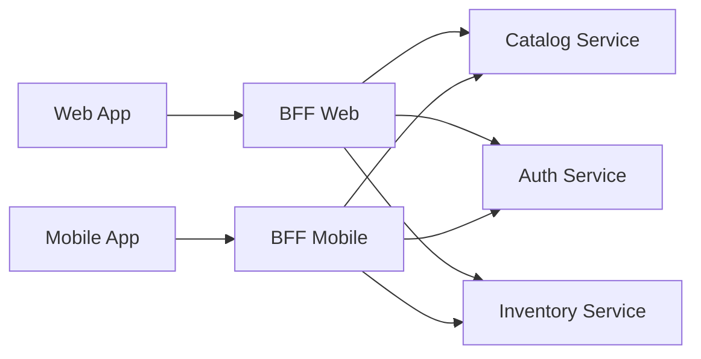

<!-- markdownlint-disable MD013 -->
# BFF (Backend for Frontend) – Pattern, Requirements, and Project Assessment

This document explains the Backend for Frontend (BFF) pattern, how it works, how to implement it,
what requirements it implies, and how it relates to other frontend–backend topics.
It also assesses whether the MovieMind API project fits the BFF pattern.

---

## Table of Contents

1. [What is BFF (Backend for Frontend)](#1-what-is-bff-backend-for-frontend)
2. [How BFF Works](#2-how-bff-works)
3. [How to Implement a BFF](#3-how-to-implement-a-bff)
4. [Requirements for a "True" BFF](#4-requirements-for-a-true-bff)
5. [Does MovieMind API Meet BFF Requirements?](#5-does-moviemind-api-meet-bff-requirements)
6. [Related Topics](#6-related-topics)
   - [API-First](#api-first)
   - [Optimistic UI](#optimistic-ui)
   - [Pessimistic UI](#pessimistic-ui)
   - [Contract-First and Client-Driven APIs](#contract-first-and-client-driven-apis)
   - [SPA vs Server-Rendered and BFF](#spa-vs-server-rendered-and-bff)
7. [See Also](#7-see-also)

---

## 1. What is BFF (Backend for Frontend)

**Definition:** A BFF is a **single-purpose server-side layer** dedicated to **one user experience** (e.g. one web app, one mobile app, or one class of clients). It sits between the client and one or more backends and is often owned by the same team that owns the UI (a pattern popularised by Sam Newman and used at SoundCloud and REA).

**Contrast with a general-purpose API:** A single API serving many different UIs (web, mobile, partners) tends to become a compromise: it must support every client’s needs, becomes a bottleneck, and often ends up maintained by a separate “middleware” team. The BFF pattern instead follows **one experience, one backend**: each BFF is tailored to one (class of) frontend.

**Typical architecture:**

One client request to a BFF can trigger multiple calls to downstream services; the BFF aggregates and shapes the response for that client.

---

## 2. How BFF Works

- **Orchestration:** A single client request can trigger **multiple downstream calls** (in parallel or sequence). The BFF aggregates results and returns one response shaped for that client (e.g. “wishlist with stock and price” from wishlist + catalog + inventory services).

- **Optimisation per client:** Payload size, fields, and number of round-trips are tuned for that UI (e.g. mobile: fewer calls, smaller payloads; desktop web: richer data). The BFF hides the complexity of calling several backends.

- **Translation layer:** The BFF can adapt protocols (REST, gRPC, GraphQL), handle auth (tokens, API keys), and hide internal service boundaries so the client sees a single, consistent API.

- **Failure handling:** If one downstream service fails, the BFF can degrade gracefully (e.g. return partial data, omit stock info) and still expose a consistent contract to the client.

- **Reuse:** Shared logic can live in shared libraries or in a downstream “aggregator” service. Duplication across BFFs is often acceptable to avoid tight coupling (Sam Newman: “relaxed about duplication across services”).

---

## 3. How to Implement a BFF

- **Ownership:** The BFF should be owned by the same team that owns the frontend (Conway’s Law: team boundaries tend to drive BFF boundaries). That way the API can evolve with the UI and releases stay aligned.

- **Technology:** Any stack (Node.js, Laravel, Go, etc.). Choice is often driven by team skills or by I/O characteristics (e.g. Node for many parallel async calls).

- **Responsibilities:**
  - Expose a **small, experience-specific API** (not a generic CRUD mirror of all backends).
  - Call downstream services (REST, gRPC, GraphQL), **in parallel** where possible.
  - Map/transform responses, filter sensitive data, apply auth and rate limiting.
  - Cache where it makes sense, with correct cache semantics for aggregated content.

- **When to add a BFF:** Consider a BFF when you have multiple client types with different needs, many microservices (so the client would otherwise make many calls), or a need for release and ownership alignment with frontend teams.

---

## 4. Requirements for a "True" BFF

| Requirement | Description |
| ----------- | ----------- |
| **Single UI / experience** | One BFF per (class of) frontend, not one API for “everyone”. |
| **Orchestration** | Composes multiple downstream services into fewer client-facing calls. |
| **Client-optimised contract** | Response shape and size tailored to that client. |
| **Team alignment** | Owned by the team that owns the UI. |
| **Downstream diversity** | Typically talks to several backends (microservices, APIs); not just one monolith. |

Optional but common: caching at the BFF, auth at the edge, protocol translation (e.g. REST in, GraphQL out).

---

## 5. Does MovieMind API Meet BFF Requirements?

**Current architecture (from CLAUDE.md and api/routes/api.php):**

- **Single deployable backend:** The MovieMind API is a Laravel application that owns the domain (movies, people, TV series, generate, jobs, health). It uses one database (PostgreSQL), Redis, and calls **external** services (OpenAI, TMDb, TVMaze). There is no internal “multiple microservices” layer; the API is the main application.

- **Clients:** The API is public (REST, API key). Documentation mentions a frontend (e.g. moviemind_frontend in MODULAR_MONOLITH_FEATURE_BASED_SCALING), but the API is not designed as “one BFF per that frontend” in the strict sense.

- **Orchestration:** There is orchestration inside the monolith (e.g. search combines local DB and external TMDb/TVMaze in `MovieSearchService`), but it is **internal** to the application, not a BFF calling N internal microservices.

**Assessment:**

- **Fits loosely:** The API can act as **the** backend for a single frontend (e.g. one web app). In that sense it is “a backend for a frontend”, but not the BFF pattern in the usual (aggregator-for-many-backends) meaning.

- **Does not fit strictly:**
  - There is no separate “BFF layer” in front of multiple internal services.
  - The system is a **modular monolith** with one public API, not “one BFF per client type” (e.g. separate BFF for web vs mobile).
  - Downstream are **external** APIs (TMDb, OpenAI, etc.), not multiple internal microservices aggregated by the BFF.

- **To become a “classic” BFF later:** You would introduce a dedicated BFF service that (a) is owned by the frontend team, (b) exposes an experience-specific API, and (c) calls the current MovieMind API plus any other backends (e.g. auth, billing) and aggregates them. The current API would then be one of the **downstream** services, not the BFF itself.

**Summary:** MovieMind API is the main domain backend and can serve a single frontend; it is **not** implemented as a BFF in the strict sense (no per-client BFF layer aggregating multiple internal services).

---

## 6. Related Topics

### API-First

**What it is:** API-First means designing and defining the API contract (e.g. OpenAPI) before or in parallel with the UI and backend implementation. The API is the main contract between frontend and backend (or between BFF and downstream services).

**Relation to BFF:** A BFF is a good place to apply API-First: the BFF’s API is the only one the frontend team depends on, so defining it first (or using contract tests) keeps the frontend and BFF aligned. MovieMind API exposes REST and can be described with OpenAPI/Swagger, which supports an API-First workflow for any client (including a future BFF).

### Optimistic UI

**What it is:** The UI updates immediately as if the operation succeeded (e.g. add to cart, like button), then reverts or shows an error if the server responds with failure. This reduces perceived latency and improves responsiveness.

**Relation to BFF:** The BFF (or any backend) must support **idempotency and clear error responses** so the client can safely retry or roll back. Optimistic UI often goes with a single “command” endpoint that the BFF orchestrates, so one round-trip can trigger several downstream calls without the client waiting for each.

### Pessimistic UI

**What it is:** The UI waits for the server response before updating (e.g. show spinner, disable button until 200/201). Simpler to implement and avoids rollback logic, but the user waits longer.

**Relation to BFF:** With a BFF, the client makes one call; the BFF’s latency is the sum of downstream calls (unless parallelised). Pessimistic UI can still be acceptable if the BFF keeps latency low (parallel calls, caching). For slow operations (e.g. AI generation), the API often returns “accepted” and a job ID, and the client polls or uses webhooks—a form of deferred update that fits both patterns.

### Contract-First and Client-Driven APIs

**What it is:** Contract-First: API spec (OpenAPI, GraphQL schema) is the source of truth; code and tests are generated or validated against it. Client-Driven (e.g. consumer-driven contract tests): the client (or BFF) defines the contract it needs, and the provider (downstream service) must satisfy it.

**Relation to BFF:** A BFF is a natural “client” of downstream services. Using consumer-driven contracts (e.g. Pact) between the BFF and each backend ensures that backends do not break the BFF’s expectations. The frontend team can then treat the BFF as the only backend and use contract tests between frontend and BFF.

### SPA vs Server-Rendered and BFF

**What it is:** SPAs (Single Page Apps) run in the browser and call APIs (or a BFF) for data. Server-rendered apps (SSR) generate HTML on the server; the server may call backends or a BFF to build the page.

**Relation to BFF:** For server-rendered UIs, the BFF is the natural place to perform server-side data fetching (one place to call many services and pass data to templates). For SPAs, the BFF is the single API the browser calls. MovieMind API is used as the backend for clients (e.g. a SPA or a future BFF); it does not itself decide SPA vs SSR—that is a frontend concern.

---

## 7. See Also

- [Sam Newman – Backends For Frontends](https://samnewman.io/patterns/architectural/bff/)
- [Microsoft Azure – Backends for Frontends pattern](https://learn.microsoft.com/en-us/azure/architecture/patterns/backends-for-frontends)
- Project: [Architecture Analysis](ARCHITECTURE_ANALYSIS.md) (Events + Jobs vs service layer)
- Project: [Modular Monolith with Feature-Based Scaling](../knowledge/technical/MODULAR_MONOLITH_FEATURE_BASED_SCALING.en.md)

**Last updated:** 2026-02-21
