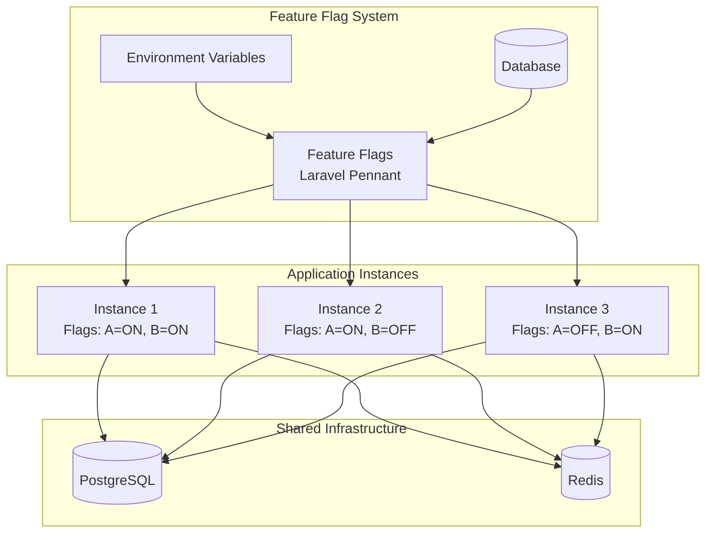
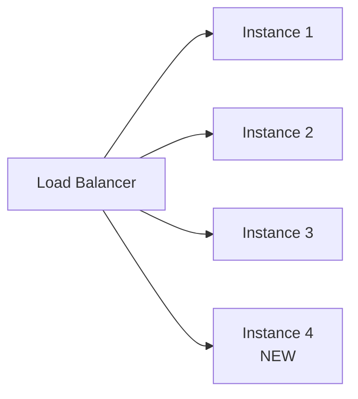
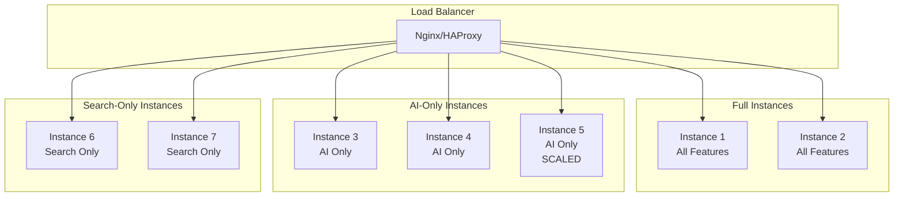
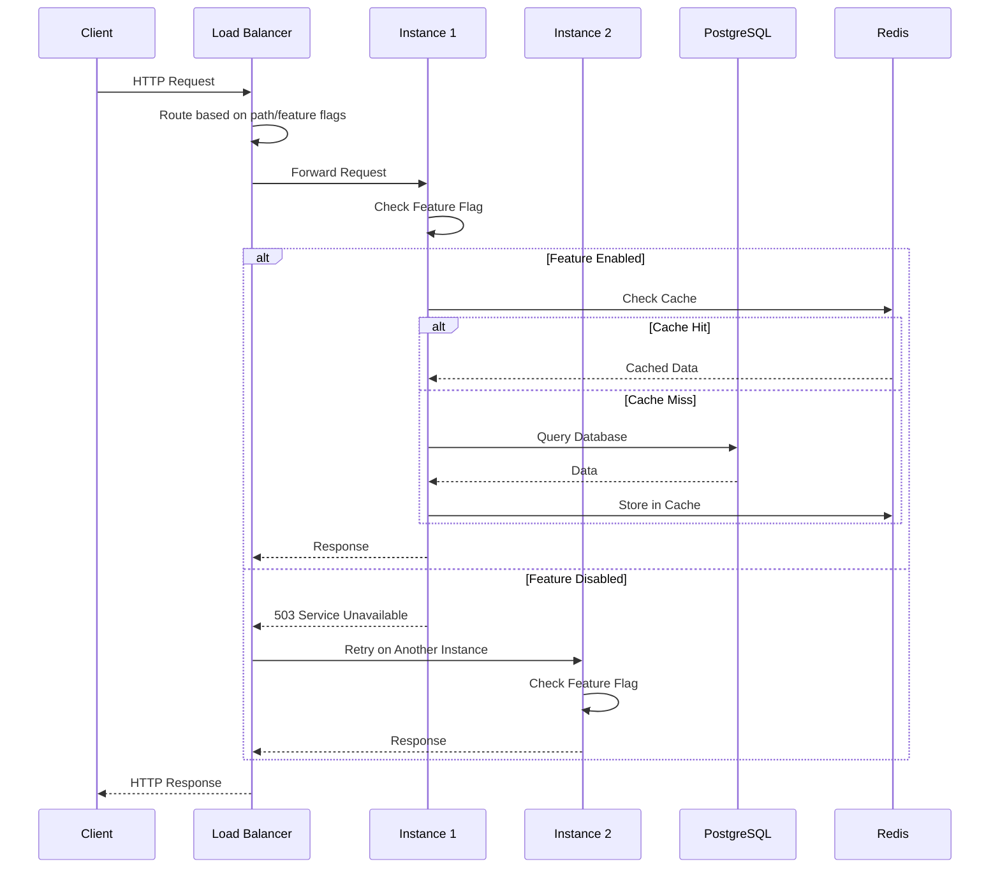
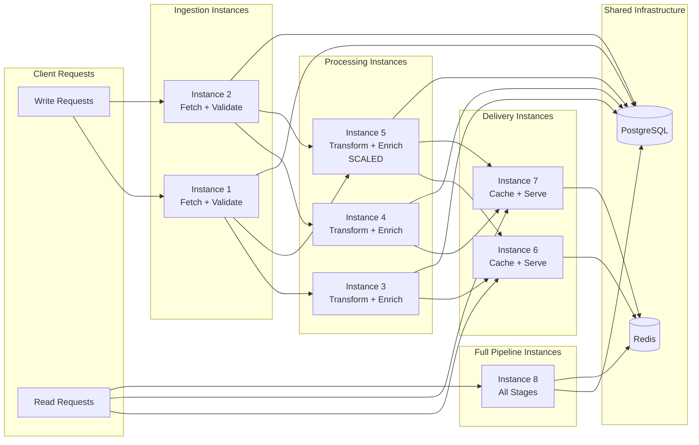

# Modular Monolith z Feature-Based Instance Scaling

## 📋 Spis Treści

1. [Wprowadzenie](#wprowadzenie)
2. [Przewodnik Architektury](#przewodnik-architektury)
3. [Koncepcja architektury](#koncepcja-architektury)
4. [Przewodnik Implementacji](#przewodnik-implementacji)
5. [Przygotowanie aplikacji](#przygotowanie-aplikacji)
6. [Przewodnik Możliwości Skalowania](#przewodnik-możliwości-skalowania)
7. [Wdrożenie w różnych środowiskach](#wdrożenie-w-różnych-środowiskach)
   - [Load Balancer (Nginx)](#load-balancer-nginx)
   - [Reverse Proxy (HAProxy)](#reverse-proxy-haproxy)
   - [Docker Swarm](#docker-swarm)
   - [Kubernetes](#kubernetes)
   - [On-Premise (Bare Metal/VMs)](#on-premise-bare-metalvms)
8. [Proste i Złożone Przykłady](#proste-i-złożone-przykłady)
   - [Prosty Przykład - Minimalna Konfiguracja](#prosty-przykład---minimalna-konfiguracja)
   - [Złożony Przykład - Pipeline-Based Scaling](#złożony-przykład---pipeline-based-scaling)
9. [Praktyczne Przykłady Skalowania](#praktyczne-przykłady-skalowania)
   - [Skalowanie z Nginx](#skalowanie-z-nginx)
   - [Skalowanie z Docker Swarm](#skalowanie-z-docker-swarm)
   - [Skalowanie z Kubernetes](#skalowanie-z-kubernetes)
10. [Laboratorium Praktyczne](#laboratorium-praktyczne)
11. [Zarządzanie Feature Flags](#zarządzanie-feature-flags)
12. [Monitoring i obserwowalność](#monitoring-i-obserwowalność)
13. [Best Practices](#best-practices)

---

## Wprowadzenie

**Modular Monolith z Feature-Based Instance Scaling** to architektura skalowania, która pozwala na:

- **Modularny monolit** - aplikacja podzielona na niezależne moduły, ale wdrożona jako jedna jednostka
- **Feature Flags** - kontrola funkcji przez flagi (Laravel Pennant)
- **Selective Scaling** - skalowanie tylko wybranych modułów przez uruchamianie dodatkowych instancji z odpowiednimi flagami
- **Horizontal Scaling** - dodawanie instancji aplikacji zamiast zwiększania zasobów pojedynczej instancji

### Zalety

✅ **Elastyczne skalowanie** - skaluj tylko te moduły, które wymagają większej wydajności  
✅ **Kontrola kosztów** - uruchamiaj tylko potrzebne instancje  
✅ **Zero-downtime deployments** - wdrażaj nowe wersje stopniowo  
✅ **A/B testing** - testuj różne wersje funkcji równolegle  
✅ **Rollback** - szybkie wyłączenie problematycznych funkcji  

### Przykład użycia

```text
┌─────────────────────────────────────────┐
│  Modular Monolith Application          │
│  ┌─────────┐ ┌─────────┐ ┌─────────┐  │
│  │ Movies  │ │ People  │ │ Search  │  │
│  └─────────┘ └─────────┘ └─────────┘  │
│  Feature Flags: [A: ON, B: ON, C: ON] │
└─────────────────────────────────────────┘
         │
         ├─── Instance 1 (Flags: Movies=ON, People=ON, Search=OFF)
         ├─── Instance 2 (Flags: Movies=ON, People=OFF, Search=ON)  ← Skalowanie Search
         └─── Instance 3 (Flags: Movies=OFF, People=ON, Search=ON)  ← Skalowanie People+Search
```

---

## Przewodnik Architektury

### Czym jest Modular Monolith?

**Modular Monolith** to architektura, w której aplikacja jest podzielona na logiczne moduły (np. Movies, People, Search), ale wszystkie moduły są wdrożone jako jedna jednostka (monolit). W przeciwieństwie do mikroserwisów, moduły współdzielą bazę danych, cache i infrastrukturę.

### Zalety Modular Monolith

✅ **Prostota wdrożenia** - jedna aplikacja, jeden deployment  
✅ **Wspólna baza danych** - łatwe transakcje między modułami  
✅ **Niski overhead** - brak komunikacji sieciowej między modułami  
✅ **Łatwe debugowanie** - wszystko w jednym miejscu  
✅ **Możliwość ewolucji** - łatwe przejście do mikroserwisów w przyszłości  

### Feature Flag Architecture

Feature flags pozwalają na kontrolę dostępności funkcji w runtime bez zmiany kodu. W kontekście skalowania, każda instancja może mieć różne kombinacje włączonych flag.



### Instance Scaling Strategies

#### 1. Horizontal Scaling (Skalowanie Poziome)

Dodawanie nowych instancji zamiast zwiększania zasobów istniejących:



**Zalety:**
- Lepsze wykorzystanie zasobów
- Wysoka dostępność (HA)
- Elastyczne skalowanie

#### 2. Selective Scaling (Selektywne Skalowanie)

Skalowanie tylko wybranych modułów przez uruchamianie instancji z odpowiednimi feature flags:



### Data Flow Architecture



### Design Decisions

#### 1. Shared Database vs Database per Module

**Wybór: Shared Database**

**Uzasadnienie:**
- Modular Monolith = jedna aplikacja
- Łatwe transakcje między modułami
- Prostsze zarządzanie
- Możliwość ewolucji do read replicas

**Trade-offs:**
- ✅ Prostsze zarządzanie
- ✅ Transakcje ACID
- ❌ Potencjalne bottleneck (rozwiązanie: read replicas)
- ❌ Coupling między modułami (akceptowalne w monolicie)

#### 2. Feature Flags per Instance vs Global

**Wybór: Feature Flags per Instance**

**Uzasadnienie:**
- Każda instancja może mieć różne flagi
- Selektywne skalowanie modułów
- A/B testing różnych konfiguracji

**Trade-offs:**
- ✅ Elastyczne skalowanie
- ✅ Zero-downtime deployments
- ❌ Większa złożoność konfiguracji
- ❌ Wymaga load balancera z routing

#### 3. Stateless Instances vs Stateful

**Wybór: Stateless Instances**

**Uzasadnienie:**
- Wszystkie dane w bazie/cache
- Brak session affinity
- Łatwe skalowanie

**Trade-offs:**
- ✅ Łatwe skalowanie
- ✅ Wysoka dostępność
- ❌ Wymaga zewnętrznego storage dla sesji (Redis/DB)

### Component Relationships

```mermaid
graph TB
    subgraph "Client Layer"
        WEB[Web Clients]
        API_CLI[API Clients]
    end
    
    subgraph "Load Balancing Layer"
        NGINX[Nginx/HAProxy]
    end
    
    subgraph "Application Layer"
        I1[Instance 1<br/>Feature Set A]
        I2[Instance 2<br/>Feature Set B]
        I3[Instance 3<br/>Feature Set C]
    end
    
    subgraph "Data Layer"
        PG[(PostgreSQL<br/>Primary)]
        PG_R[(PostgreSQL<br/>Read Replica]
        RD[(Redis<br/>Cache + Queue)]
    end
    
    subgraph "External Services"
        OPENAI[OpenAI API]
        TMDb[TMDb API]
    end
    
    WEB --> NGINX
    API_CLI --> NGINX
    NGINX --> I1
    NGINX --> I2
    NGINX --> I3
    
    I1 --> PG
    I2 --> PG
    I3 --> PG
    
    I1 --> PG_R
    I2 --> PG_R
    I3 --> PG_R
    
    I1 --> RD
    I2 --> RD
    I3 --> RD
    
    I1 --> OPENAI
    I2 --> OPENAI
    I3 --> TMDb
```

### Decision Points

#### Kiedy użyć Modular Monolith z Feature-Based Scaling?

✅ **Użyj gdy:**
- Aplikacja ma wyraźne moduły biznesowe
- Potrzebujesz elastycznego skalowania
- Chcesz kontrolować koszty (skaluj tylko potrzebne moduły)
- Potrzebujesz zero-downtime deployments
- Chcesz testować różne wersje funkcji (A/B testing)

❌ **Nie używaj gdy:**
- Aplikacja jest bardzo prosta (overhead nieuzasadniony)
- Moduły wymagają całkowitej izolacji (lepiej mikroserwisy)
- Zespół nie ma doświadczenia z feature flags
- Infrastruktura nie wspiera load balancing

#### Kiedy przejść do Mikroserwisów?

Rozważ przejście do mikroserwisów gdy:
- Moduły wymagają niezależnego skalowania (różne technologie)
- Zespół jest duży i potrzebuje niezależnych deploymentów
- Wymagana jest geograficzna dystrybucja
- Moduły mają bardzo różne wymagania SLA

---

## Koncepcja architektury

### Komponenty

1. **Aplikacja Modular Monolith**
   - Wszystkie moduły w jednej aplikacji
   - Feature flags kontrolują dostępność funkcji
   - Wspólna baza danych i cache

2. **Load Balancer / Reverse Proxy**
   - Rozdziela ruch między instancje
   - Health checks
   - Session affinity (opcjonalnie)

3. **Instancje aplikacji**
   - Każda instancja może mieć różne feature flags
   - Współdzielą bazę danych i cache
   - Niezależne skalowanie

4. **Shared Infrastructure**
   - PostgreSQL (wspólna baza danych)
   - Redis (wspólny cache i queue)
   - Storage (wspólne pliki)

### Flow requestu

```text
Client Request
    ↓
Load Balancer (routing based on feature flags)
    ↓
Instance 1 (Feature A=ON, B=OFF)
    ↓
Feature Flag Check
    ↓
If enabled → Process Request
If disabled → Return 404/503 or route to another instance
```

---

## Przewodnik Implementacji

### Krok 1: Instalacja i Konfiguracja Laravel Pennant

#### Instalacja

```bash
composer require laravel/pennant
php artisan vendor:publish --provider="Laravel\Pennant\PennantServiceProvider"
php artisan migrate
```

#### Konfiguracja Feature Flags

Utwórz plik `config/pennant.php`:

```php
<?php

return [
    'default' => 'database',
    
    'stores' => [
        'database' => [
            'driver' => 'database',
            'connection' => null,
            'table' => 'features',
        ],
    ],
    
    'flags' => [
        'ai_description_generation' => [
            'class' => \App\Features\AiDescriptionGeneration::class,
            'description' => 'Enables AI-generated movie/series descriptions.',
            'category' => 'core_ai',
            'default' => true,
            'togglable' => true,
        ],
        'ai_bio_generation' => [
            'class' => \App\Features\AiBioGeneration::class,
            'description' => 'Enables AI-generated actor biographies.',
            'category' => 'core_ai',
            'default' => true,
            'togglable' => true,
        ],
        'public_search_advanced' => [
            'class' => \App\Features\PublicSearchAdvanced::class,
            'description' => 'Enables advanced search functionality.',
            'category' => 'public_api',
            'default' => false,
            'togglable' => true,
        ],
    ],
];
```

### Krok 2: Implementacja Health Check Endpoint

#### Controller

```php
<?php

declare(strict_types=1);

namespace App\Http\Controllers\Api;

use App\Http\Controllers\Controller;
use Illuminate\Http\JsonResponse;
use Illuminate\Support\Facades\Cache;
use Laravel\Pennant\Feature;

class HealthController extends Controller
{
    public function instance(): JsonResponse
    {
        $instanceId = env('INSTANCE_ID', 'unknown');
        
        $activeFeatures = [];
        foreach (config('pennant.flags', []) as $name => $config) {
            $activeFeatures[$name] = Feature::active($name);
        }
        
        return response()->json([
            'instance_id' => $instanceId,
            'status' => 'healthy',
            'features' => $activeFeatures,
            'timestamp' => now()->toIso8601String(),
            'version' => config('app.version', '1.0.0'),
        ]);
    }
    
    public function liveness(): JsonResponse
    {
        return response()->json([
            'status' => 'alive',
            'timestamp' => now()->toIso8601String(),
        ]);
    }
    
    public function readiness(): JsonResponse
    {
        // Check database connection
        try {
            \DB::connection()->getPdo();
            $dbStatus = 'connected';
        } catch (\Exception $e) {
            $dbStatus = 'disconnected';
        }
        
        // Check Redis connection
        try {
            Cache::store('redis')->put('health_check', 'ok', 1);
            $redisStatus = 'connected';
        } catch (\Exception $e) {
            $redisStatus = 'disconnected';
        }
        
        $isReady = $dbStatus === 'connected' && $redisStatus === 'connected';
        
        return response()->json([
            'status' => $isReady ? 'ready' : 'not_ready',
            'database' => $dbStatus,
            'redis' => $redisStatus,
            'timestamp' => now()->toIso8601String(),
        ], $isReady ? 200 : 503);
    }
}
```

#### Routes

```php
// routes/api.php
Route::get('/health/instance', [HealthController::class, 'instance']);
Route::get('/health/liveness', [HealthController::class, 'liveness']);
Route::get('/health/readiness', [HealthController::class, 'readiness']);
```

### Krok 3: Middleware dla Feature Flags

```php
<?php

declare(strict_types=1);

namespace App\Http\Middleware;

use Closure;
use Illuminate\Http\Request;
use Illuminate\Http\Response;
use Laravel\Pennant\Feature;

class FeatureFlagMiddleware
{
    public function handle(Request $request, Closure $next, string $feature): Response
    {
        if (!Feature::active($feature)) {
            return response()->json([
                'error' => 'Feature not available on this instance',
                'feature' => $feature,
                'instance_id' => env('INSTANCE_ID', 'unknown'),
            ], 503);
        }
        
        return $next($request);
    }
}
```

#### Rejestracja Middleware

```php
// app/Http/Kernel.php lub bootstrap/app.php (Laravel 11+)
protected $middlewareAliases = [
    'feature' => \App\Http\Middleware\FeatureFlagMiddleware::class,
];
```

#### Użycie w Routes

```php
Route::middleware(['feature:ai_description_generation'])->group(function () {
    Route::post('/api/v1/generate', [GenerateController::class, 'store']);
});
```

### Krok 4: Service Provider dla Feature Flags per Instance

```php
<?php

declare(strict_types=1);

namespace App\Providers;

use Illuminate\Support\ServiceProvider;
use Laravel\Pennant\Feature;

class AppServiceProvider extends ServiceProvider
{
    public function boot(): void
    {
        // Override feature flags from environment variables
        $instanceId = env('INSTANCE_ID');
        
        if ($instanceId) {
            foreach (config('pennant.flags', []) as $name => $config) {
                $envKey = 'FEATURE_' . strtoupper(str_replace(['-', '_'], '_', $name));
                $envValue = env($envKey);
                
                if ($envValue !== null) {
                    $value = filter_var($envValue, FILTER_VALIDATE_BOOLEAN);
                    Feature::for('instance:' . $instanceId)->activate($name, $value);
                }
            }
        }
    }
}
```

### Krok 5: Konfiguracja Zmiennych Środowiskowych

#### .env.example

```bash
# Instance Configuration
INSTANCE_ID=api-1

# Feature Flags
FEATURE_AI_DESCRIPTION=true
FEATURE_AI_BIO=true
FEATURE_ADVANCED_SEARCH=false

# Database
DB_CONNECTION=pgsql
DB_HOST=db
DB_PORT=5432
DB_DATABASE=moviemind
DB_USERNAME=moviemind
DB_PASSWORD=moviemind

# Redis
REDIS_HOST=redis
REDIS_PORT=6379

# Application
APP_ENV=production
APP_DEBUG=false
APP_URL=http://localhost:8000
```

### Krok 6: Konfiguracja Logowania dla Instancji

```php
// config/logging.php
'channels' => [
    'instance' => [
        'driver' => 'daily',
        'path' => storage_path('logs/instance-' . env('INSTANCE_ID', 'default') . '.log'),
        'level' => env('LOG_LEVEL', 'debug'),
        'days' => 14,
    ],
],
```

### Krok 7: Testowanie Konfiguracji

#### Test Health Check

```bash
curl http://localhost:8000/health/instance
```

Oczekiwany wynik:

```json
{
  "instance_id": "api-1",
  "status": "healthy",
  "features": {
    "ai_description_generation": true,
    "ai_bio_generation": true,
    "public_search_advanced": false
  },
  "timestamp": "2025-01-28T10:00:00Z",
  "version": "1.0.0"
}
```

#### Test Feature Flag

```php
// tests/Feature/FeatureFlagTest.php
public function test_feature_flag_is_active_on_instance(): void
{
    putenv('INSTANCE_ID=api-1');
    putenv('FEATURE_AI_DESCRIPTION=true');
    
    $this->assertTrue(Feature::active('ai_description_generation'));
}

public function test_feature_flag_is_inactive_on_instance(): void
{
    putenv('INSTANCE_ID=api-2');
    putenv('FEATURE_AI_DESCRIPTION=false');
    
    $this->assertFalse(Feature::active('ai_description_generation'));
}
```

### Troubleshooting

#### Problem: Feature flags nie działają

**Rozwiązanie:**
1. Sprawdź czy Laravel Pennant jest zainstalowany: `composer show laravel/pennant`
2. Sprawdź czy migracja została wykonana: `php artisan migrate:status`
3. Sprawdź logi: `tail -f storage/logs/laravel.log`
4. Sprawdź zmienne środowiskowe: `php artisan tinker` → `env('INSTANCE_ID')`

#### Problem: Health check zwraca 503

**Rozwiązanie:**
1. Sprawdź połączenie z bazą danych: `php artisan tinker` → `\DB::connection()->getPdo()`
2. Sprawdź połączenie z Redis: `php artisan tinker` → `Cache::put('test', 'ok')`
3. Sprawdź logi aplikacji: `tail -f storage/logs/laravel.log`

#### Problem: Instancje nie widzą się nawzajem

**Rozwiązanie:**
1. Sprawdź czy wszystkie instancje używają tej samej bazy danych
2. Sprawdź czy wszystkie instancje używają tego samego Redis
3. Sprawdź konfigurację sieci w Docker Compose
4. Sprawdź czy load balancer poprawnie routuje requesty

---

## Przygotowanie aplikacji

### 1. Konfiguracja Feature Flags per Instance

Każda instancja powinna mieć unikalny identyfikator i konfigurację feature flags.

#### Opcja A: Zmienne środowiskowe

```bash
# Instance 1
INSTANCE_ID=api-1
FEATURE_FLAGS_OVERRIDE=ai_description_generation:true,ai_bio_generation:true,public_search_advanced:false

# Instance 2
INSTANCE_ID=api-2
FEATURE_FLAGS_OVERRIDE=ai_description_generation:true,ai_bio_generation:false,public_search_advanced:true
```

#### Opcja B: Plik konfiguracyjny

```php
// config/instance-features.php
return [
    'instance_id' => env('INSTANCE_ID', 'default'),
    'features' => [
        'ai_description_generation' => env('FEATURE_AI_DESCRIPTION', true),
        'ai_bio_generation' => env('FEATURE_AI_BIO', true),
        'public_search_advanced' => env('FEATURE_ADVANCED_SEARCH', false),
    ],
];
```

### 2. Health Check Endpoint

Dodaj endpoint, który zwraca status instancji i aktywne feature flags:

```php
// routes/api.php
Route::get('/health/instance', [HealthController::class, 'instance']);
```

```php
// app/Http/Controllers/Api/HealthController.php
public function instance(): JsonResponse
{
    $activeFeatures = [];
    foreach (config('pennant.flags', []) as $name => $config) {
        $activeFeatures[$name] = Feature::active($name);
    }

    return response()->json([
        'instance_id' => env('INSTANCE_ID', 'unknown'),
        'status' => 'healthy',
        'features' => $activeFeatures,
        'timestamp' => now()->toIso8601String(),
    ]);
}
```

### 3. Middleware dla Feature Flags

Opcjonalnie: middleware, który weryfikuje dostępność funkcji przed przetworzeniem requestu:

```php
// app/Http/Middleware/FeatureFlagMiddleware.php
public function handle(Request $request, Closure $next, string $feature): Response
{
    if (!Feature::active($feature)) {
        return response()->json([
            'error' => 'Feature not available on this instance',
            'feature' => $feature,
            'instance_id' => env('INSTANCE_ID'),
        ], 503);
    }

    return $next($request);
}
```

---

## Przewodnik Możliwości Skalowania

### Przegląd Metod Skalowania

Dostępne są trzy główne metody skalowania Modular Monolith z Feature-Based Instance Scaling:

1. **Nginx Load Balancing** - Proste, lekkie, idealne dla małych i średnich aplikacji
2. **Docker Swarm** - Wbudowane w Docker, łatwe zarządzanie, dobre dla średnich aplikacji
3. **Kubernetes** - Najbardziej zaawansowane, idealne dla dużych aplikacji i produkcji

### Tabela Porównawcza

| Cecha | Nginx | Docker Swarm | Kubernetes |
|-------|-------|--------------|------------|
| **Złożoność konfiguracji** | Niska | Średnia | Wysoka |
| **Krzywa uczenia** | Łatwa | Średnia | Trudna |
| **Auto-scaling** | ❌ Manual | ✅ Limited | ✅ Full (HPA) |
| **Service Discovery** | ❌ Manual | ✅ Built-in | ✅ Built-in |
| **Rolling Updates** | ❌ Manual | ✅ Built-in | ✅ Built-in |
| **Health Checks** | ✅ Basic | ✅ Advanced | ✅ Advanced |
| **Resource Management** | ❌ Manual | ✅ Basic | ✅ Advanced |
| **Cost** | Niski | Średni | Wysoki (infra) |
| **Idealne dla** | Małe/Średnie | Średnie | Duże/Enterprise |
| **Minimalna infrastruktura** | 1 serwer | 1+ serwerów | 3+ serwerów |
| **Maintenance** | Niski | Średni | Wysoki |

### Macierz Decyzyjna

#### Kiedy użyć Nginx?

✅ **Użyj Nginx gdy:**
- Masz 1-5 instancji aplikacji
- Potrzebujesz prostego rozwiązania
- Masz ograniczony budżet
- Zespół ma małe doświadczenie z orchestracją
- Aplikacja działa na pojedynczym serwerze lub kilku serwerach
- Nie potrzebujesz auto-scaling

❌ **Nie używaj Nginx gdy:**
- Potrzebujesz auto-scaling
- Masz więcej niż 10 instancji
- Potrzebujesz zaawansowanego zarządzania zasobami
- Potrzebujesz service mesh

#### Kiedy użyć Docker Swarm?

✅ **Użyj Docker Swarm gdy:**
- Masz 3-20 instancji aplikacji
- Chcesz prostszą alternatywę dla Kubernetes
- Masz doświadczenie z Dockerem
- Potrzebujesz podstawowego auto-scaling
- Masz budżet na kilka serwerów
- Chcesz wbudowane service discovery

❌ **Nie używaj Docker Swarm gdy:**
- Potrzebujesz zaawansowanego auto-scaling (HPA)
- Masz bardzo dużą aplikację (100+ instancji)
- Potrzebujesz service mesh
- Potrzebujesz zaawansowanego zarządzania zasobami

#### Kiedy użyć Kubernetes?

✅ **Użyj Kubernetes gdy:**
- Masz 20+ instancji aplikacji
- Potrzebujesz pełnego auto-scaling (HPA, VPA)
- Masz duży zespół DevOps
- Potrzebujesz service mesh (Istio, Linkerd)
- Masz budżet na infrastrukturę
- Potrzebujesz zaawansowanego zarządzania zasobami
- Aplikacja jest krytyczna dla biznesu

❌ **Nie używaj Kubernetes gdy:**
- Masz małą aplikację (< 5 instancji)
- Zespół nie ma doświadczenia z K8s
- Masz ograniczony budżet
- Nie potrzebujesz auto-scaling
- Chcesz prostsze rozwiązanie

### Analiza Kosztów

#### Nginx (1 serwer)

```
Koszty:
- Serwer: $20-50/miesiąc (VPS)
- Nginx: $0 (open source)
- Monitoring: $0-10/miesiąc (opcjonalnie)
- Total: ~$20-60/miesiąc
```

#### Docker Swarm (3 serwery)

```
Koszty:
- Serwery: $60-150/miesiąc (3x VPS)
- Docker: $0 (open source)
- Monitoring: $0-20/miesiąc
- Total: ~$60-170/miesiąc
```

#### Kubernetes (3+ serwery)

```
Koszty:
- Serwery: $100-300/miesiąc (3+ VPS/Cloud)
- Kubernetes: $0 (open source) lub $50-200/miesiąc (managed)
- Monitoring: $20-50/miesiąc
- Total: ~$120-550/miesiąc
```

### Charakterystyka Wydajności

#### Nginx

- **Latencja:** ~1-5ms (dodatkowa warstwa)
- **Throughput:** ~10k-50k req/s (zależnie od konfiguracji)
- **Resource Usage:** ~50-100MB RAM
- **Scalability:** Manual, do ~10 instancji

#### Docker Swarm

- **Latencja:** ~2-10ms (service discovery)
- **Throughput:** ~5k-30k req/s per service
- **Resource Usage:** ~200-500MB RAM per node
- **Scalability:** Auto (limited), do ~50 instancji

#### Kubernetes

- **Latencja:** ~5-20ms (service mesh overhead)
- **Throughput:** ~10k-100k req/s (zależnie od konfiguracji)
- **Resource Usage:** ~500MB-2GB RAM per node
- **Scalability:** Auto (full), do 1000+ instancji

### Złożoność Operacyjna

#### Nginx

**Zadania operacyjne:**
- Konfiguracja ręczna load balancera
- Ręczne dodawanie/usuwanie instancji
- Ręczne zarządzanie health checks
- Ręczne rolling updates

**Czas na setup:** ~2-4 godziny  
**Czas na maintenance:** ~2-4 godziny/miesiąc

#### Docker Swarm

**Zadania operacyjne:**
- Konfiguracja stack definition
- Automatyczne service discovery
- Automatyczne health checks
- Automatyczne rolling updates (z konfiguracją)

**Czas na setup:** ~4-8 godzin  
**Czas na maintenance:** ~4-8 godzin/miesiąc

#### Kubernetes

**Zadania operacyjne:**
- Konfiguracja deployment manifests
- Konfiguracja services i ingress
- Konfiguracja HPA (auto-scaling)
- Monitoring i alerting
- Backup i disaster recovery

**Czas na setup:** ~16-40 godzin  
**Czas na maintenance:** ~8-16 godzin/miesiąc

### Rekomendacje

#### Dla Małych Aplikacji (< 5 instancji)

**Rekomendacja: Nginx**

- Proste w konfiguracji
- Niskie koszty
- Wystarczająca wydajność
- Łatwe w utrzymaniu

#### Dla Średnich Aplikacji (5-20 instancji)

**Rekomendacja: Docker Swarm**

- Dobra równowaga między złożonością a funkcjonalnością
- Wbudowane funkcje orchestracji
- Rozsądne koszty
- Możliwość ewolucji do Kubernetes

#### Dla Dużych Aplikacji (20+ instancji)

**Rekomendacja: Kubernetes**

- Pełne możliwości auto-scaling
- Zaawansowane zarządzanie zasobami
- Service mesh dla zaawansowanego routingu
- Enterprise-grade features

### Migracja między Rozwiązaniami

#### Nginx → Docker Swarm

**Kroki:**
1. Przygotuj Docker Compose z wieloma instancjami
2. Skonfiguruj Docker Swarm
3. Przenieś konfigurację Nginx do Swarm
4. Przetestuj w środowisku staging
5. Wdróż w produkcji

**Czas:** ~1-2 dni

#### Docker Swarm → Kubernetes

**Kroki:**
1. Przygotuj Kubernetes manifests
2. Skonfiguruj klaster Kubernetes
3. Przenieś konfigurację z docker-stack.yml do K8s
4. Skonfiguruj HPA i monitoring
5. Przetestuj w środowisku staging
6. Wdróż w produkcji

**Czas:** ~3-5 dni

---

## Wdrożenie w różnych środowiskach

### Load Balancer (Nginx)

#### Konfiguracja Nginx z Load Balancing

```nginx
# /etc/nginx/conf.d/moviemind-api.conf

upstream moviemind_api {
    # Instance 1 - wszystkie funkcje
    server api-1:8000 weight=3 max_fails=3 fail_timeout=30s;
    
    # Instance 2 - tylko AI generation
    server api-2:8000 weight=2 max_fails=3 fail_timeout=30s;
    
    # Instance 3 - tylko search i cache
    server api-3:8000 weight=1 max_fails=3 fail_timeout=30s;
    
    # Health check
    keepalive 32;
}

# Routing based on path
server {
    listen 80;
    server_name api.moviemind.com;

    # Health check endpoint
    location /health {
        access_log off;
        proxy_pass http://moviemind_api/up;
        proxy_set_header Host $host;
    }

    # AI generation endpoints → Instance 1, 2
    location ~ ^/api/v1/(generate|movies|people)/.* {
        proxy_pass http://moviemind_api;
        proxy_set_header Host $host;
        proxy_set_header X-Real-IP $remote_addr;
        proxy_set_header X-Forwarded-For $proxy_add_x_forwarded_for;
        proxy_set_header X-Forwarded-Proto $scheme;
        
        # Prefer instances with AI features enabled
        proxy_next_upstream error timeout http_503;
    }

    # Search endpoints → Instance 1, 3
    location ~ ^/api/v1/search {
        proxy_pass http://moviemind_api;
        proxy_set_header Host $host;
        proxy_set_header X-Real-IP $remote_addr;
        proxy_set_header X-Forwarded-For $proxy_add_x_forwarded_for;
        proxy_set_header X-Forwarded-Proto $scheme;
    }

    # Default routing
    location / {
        proxy_pass http://moviemind_api;
        proxy_set_header Host $host;
        proxy_set_header X-Real-IP $remote_addr;
        proxy_set_header X-Forwarded-For $proxy_add_x_forwarded_for;
        proxy_set_header X-Forwarded-Proto $scheme;
    }
}
```

#### Docker Compose z wieloma instancjami

```yaml
version: "3.9"

services:
  nginx:
    image: nginx:1.27-alpine
    container_name: moviemind-nginx
    ports:
      - "8000:80"
    volumes:
      - ./docker/nginx/load-balancer.conf:/etc/nginx/conf.d/default.conf:ro
    depends_on:
      - api-1
      - api-2
      - api-3

  api-1:
    build:
      context: .
      dockerfile: docker/php/Dockerfile
    environment:
      INSTANCE_ID: api-1
      FEATURE_AI_DESCRIPTION: "true"
      FEATURE_AI_BIO: "true"
      FEATURE_ADVANCED_SEARCH: "false"
      # ... other env vars
    depends_on:
      - db
      - redis

  api-2:
    build:
      context: .
      dockerfile: docker/php/Dockerfile
    environment:
      INSTANCE_ID: api-2
      FEATURE_AI_DESCRIPTION: "true"
      FEATURE_AI_BIO: "false"
      FEATURE_ADVANCED_SEARCH: "true"
      # ... other env vars
    depends_on:
      - db
      - redis

  api-3:
    build:
      context: .
      dockerfile: docker/php/Dockerfile
    environment:
      INSTANCE_ID: api-3
      FEATURE_AI_DESCRIPTION: "false"
      FEATURE_AI_BIO: "true"
      FEATURE_ADVANCED_SEARCH: "true"
      # ... other env vars
    depends_on:
      - db
      - redis

  db:
    image: postgres:15
    # ... config

  redis:
    image: redis:7-alpine
    # ... config
```

---

### Reverse Proxy (HAProxy)

#### Konfiguracja HAProxy

```haproxy
# /etc/haproxy/haproxy.cfg

global
    log /dev/log local0
    maxconn 4096
    daemon

defaults
    log global
    mode http
    option httplog
    option dontlognull
    timeout connect 5000ms
    timeout client 50000ms
    timeout server 50000ms

# Frontend
frontend moviemind_frontend
    bind *:80
    default_backend moviemind_backend

    # Health check
    acl is_health_check path_beg /health
    use_backend health_backend if is_health_check

    # Route AI generation to instances with AI features
    acl is_ai_generation path_beg /api/v1/generate /api/v1/movies /api/v1/people
    use_backend ai_backend if is_ai_generation

    # Route search to instances with search features
    acl is_search path_beg /api/v1/search
    use_backend search_backend if is_search

# Backend - All instances (default)
backend moviemind_backend
    balance roundrobin
    option httpchk GET /health/instance
    http-check expect status 200
    
    server api-1 api-1:8000 check inter 5s fall 3 rise 2
    server api-2 api-2:8000 check inter 5s fall 3 rise 2
    server api-3 api-3:8000 check inter 5s fall 3 rise 2

# Backend - AI generation instances
backend ai_backend
    balance roundrobin
    option httpchk GET /health/instance
    http-check expect status 200
    http-check expect string "ai_description_generation.*true"
    
    server api-1 api-1:8000 check inter 5s fall 3 rise 2
    server api-2 api-2:8000 check inter 5s fall 3 rise 2

# Backend - Search instances
backend search_backend
    balance roundrobin
    option httpchk GET /health/instance
    http-check expect status 200
    http-check expect string "public_search_advanced.*true"
    
    server api-2 api-2:8000 check inter 5s fall 3 rise 2
    server api-3 api-3:8000 check inter 5s fall 3 rise 2

# Backend - Health check
backend health_backend
    server api-1 api-1:8000
```

---

### Docker Swarm

#### Stack Definition

```yaml
# docker-stack.yml

version: "3.9"

services:
  nginx:
    image: nginx:1.27-alpine
    ports:
      - "8000:80"
    volumes:
      - ./docker/nginx/load-balancer.conf:/etc/nginx/conf.d/default.conf:ro
    deploy:
      replicas: 1
      placement:
        constraints:
          - node.role == manager
    networks:
      - moviemind_network

  api:
    image: moviemind-api:latest
    environment:
      INSTANCE_ID: "api-${HOSTNAME}"
      FEATURE_AI_DESCRIPTION: "true"
      FEATURE_AI_BIO: "true"
      FEATURE_ADVANCED_SEARCH: "false"
      # ... other env vars
    deploy:
      replicas: 3
      update_config:
        parallelism: 1
        delay: 10s
        failure_action: rollback
      restart_policy:
        condition: on-failure
        delay: 5s
        max_attempts: 3
    networks:
      - moviemind_network
    depends_on:
      - db
      - redis

  api-ai-only:
    image: moviemind-api:latest
    environment:
      INSTANCE_ID: "api-ai-${HOSTNAME}"
      FEATURE_AI_DESCRIPTION: "true"
      FEATURE_AI_BIO: "false"
      FEATURE_ADVANCED_SEARCH: "false"
      # ... other env vars
    deploy:
      replicas: 2
      update_config:
        parallelism: 1
        delay: 10s
      restart_policy:
        condition: on-failure
    networks:
      - moviemind_network
    depends_on:
      - db
      - redis

  api-search-only:
    image: moviemind-api:latest
    environment:
      INSTANCE_ID: "api-search-${HOSTNAME}"
      FEATURE_AI_DESCRIPTION: "false"
      FEATURE_AI_BIO: "false"
      FEATURE_ADVANCED_SEARCH: "true"
      # ... other env vars
    deploy:
      replicas: 2
      update_config:
        parallelism: 1
        delay: 10s
      restart_policy:
        condition: on-failure
    networks:
      - moviemind_network
    depends_on:
      - db
      - redis

  db:
    image: postgres:15
    volumes:
      - db_data:/var/lib/postgresql/data
    deploy:
      replicas: 1
      placement:
        constraints:
          - node.role == manager
    networks:
      - moviemind_network

  redis:
    image: redis:7-alpine
    volumes:
      - redis_data:/data
    deploy:
      replicas: 1
    networks:
      - moviemind_network

networks:
  moviemind_network:
    driver: overlay

volumes:
  db_data:
  redis_data:
```

#### Deployment

```bash
# Initialize Swarm
docker swarm init

# Deploy stack
docker stack deploy -c docker-stack.yml moviemind

# Scale specific service
docker service scale moviemind_api-ai-only=5

# Update service
docker service update --env-add FEATURE_AI_DESCRIPTION=true moviemind_api
```

---

### Kubernetes

#### Deployment Manifest

```yaml
# k8s/deployment.yaml

apiVersion: apps/v1
kind: Deployment
metadata:
  name: moviemind-api
  labels:
    app: moviemind-api
spec:
  replicas: 3
  selector:
    matchLabels:
      app: moviemind-api
  template:
    metadata:
      labels:
        app: moviemind-api
        instance-type: full
    spec:
      containers:
      - name: api
        image: moviemind-api:latest
        ports:
        - containerPort: 8000
        env:
        - name: INSTANCE_ID
          valueFrom:
            fieldRef:
              fieldPath: metadata.name
        - name: FEATURE_AI_DESCRIPTION
          value: "true"
        - name: FEATURE_AI_BIO
          value: "true"
        - name: FEATURE_ADVANCED_SEARCH
          value: "false"
        # ... other env vars
        livenessProbe:
          httpGet:
            path: /health/instance
            port: 8000
          initialDelaySeconds: 30
          periodSeconds: 10
        readinessProbe:
          httpGet:
            path: /health/instance
            port: 8000
          initialDelaySeconds: 5
          periodSeconds: 5
        resources:
          requests:
            memory: "256Mi"
            cpu: "250m"
          limits:
            memory: "512Mi"
            cpu: "500m"
---
apiVersion: apps/v1
kind: Deployment
metadata:
  name: moviemind-api-ai
  labels:
    app: moviemind-api
    instance-type: ai-only
spec:
  replicas: 2
  selector:
    matchLabels:
      app: moviemind-api
      instance-type: ai-only
  template:
    metadata:
      labels:
        app: moviemind-api
        instance-type: ai-only
    spec:
      containers:
      - name: api
        image: moviemind-api:latest
        ports:
        - containerPort: 8000
        env:
        - name: INSTANCE_ID
          valueFrom:
            fieldRef:
              fieldPath: metadata.name
        - name: FEATURE_AI_DESCRIPTION
          value: "true"
        - name: FEATURE_AI_BIO
          value: "false"
        - name: FEATURE_ADVANCED_SEARCH
          value: "false"
        # ... other env vars
        livenessProbe:
          httpGet:
            path: /health/instance
            port: 8000
          initialDelaySeconds: 30
          periodSeconds: 10
        readinessProbe:
          httpGet:
            path: /health/instance
            port: 8000
          initialDelaySeconds: 5
          periodSeconds: 5
---
apiVersion: apps/v1
kind: Deployment
metadata:
  name: moviemind-api-search
  labels:
    app: moviemind-api
    instance-type: search-only
spec:
  replicas: 2
  selector:
    matchLabels:
      app: moviemind-api
      instance-type: search-only
  template:
    metadata:
      labels:
        app: moviemind-api
        instance-type: search-only
    spec:
      containers:
      - name: api
        image: moviemind-api:latest
        ports:
        - containerPort: 8000
        env:
        - name: INSTANCE_ID
          valueFrom:
            fieldRef:
              fieldPath: metadata.name
        - name: FEATURE_AI_DESCRIPTION
          value: "false"
        - name: FEATURE_AI_BIO
          value: "false"
        - name: FEATURE_ADVANCED_SEARCH
          value: "true"
        # ... other env vars
        livenessProbe:
          httpGet:
            path: /health/instance
            port: 8000
          initialDelaySeconds: 30
          periodSeconds: 10
        readinessProbe:
          httpGet:
            path: /health/instance
            port: 8000
          initialDelaySeconds: 5
          periodSeconds: 5
---
apiVersion: v1
kind: Service
metadata:
  name: moviemind-api
spec:
  selector:
    app: moviemind-api
  ports:
  - protocol: TCP
    port: 80
    targetPort: 8000
  type: ClusterIP
---
apiVersion: networking.k8s.io/v1
kind: Ingress
metadata:
  name: moviemind-api-ingress
  annotations:
    nginx.ingress.kubernetes.io/rewrite-target: /
    nginx.ingress.kubernetes.io/ssl-redirect: "true"
spec:
  ingressClassName: nginx
  rules:
  - host: api.moviemind.com
    http:
      paths:
      - path: /
        pathType: Prefix
        backend:
          service:
            name: moviemind-api
            port:
              number: 80
```

#### Service with Feature-Based Routing

```yaml
# k8s/service-routing.yaml

apiVersion: v1
kind: Service
metadata:
  name: moviemind-api-ai
spec:
  selector:
    app: moviemind-api
    instance-type: ai-only
  ports:
  - protocol: TCP
    port: 80
    targetPort: 8000
---
apiVersion: v1
kind: Service
metadata:
  name: moviemind-api-search
spec:
  selector:
    app: moviemind-api
    instance-type: search-only
  ports:
  - protocol: TCP
    port: 80
    targetPort: 8000
---
apiVersion: networking.k8s.io/v1
kind: Ingress
metadata:
  name: moviemind-api-ingress
  annotations:
    nginx.ingress.kubernetes.io/rewrite-target: /
    nginx.ingress.kubernetes.io/use-regex: "true"
spec:
  ingressClassName: nginx
  rules:
  - host: api.moviemind.com
    http:
      paths:
      # AI generation endpoints → AI instances
      - path: /api/v1/(generate|movies|people)
        pathType: Prefix
        backend:
          service:
            name: moviemind-api-ai
            port:
              number: 80
      # Search endpoints → Search instances
      - path: /api/v1/search
        pathType: Prefix
        backend:
          service:
            name: moviemind-api-search
            port:
              number: 80
      # Default → All instances
      - path: /
        pathType: Prefix
        backend:
          service:
            name: moviemind-api
            port:
              number: 80
```

#### Deployment Commands

```bash
# Apply deployments
kubectl apply -f k8s/deployment.yaml

# Scale deployment
kubectl scale deployment moviemind-api-ai --replicas=5

# Update feature flags
kubectl set env deployment/moviemind-api-ai FEATURE_AI_DESCRIPTION=true

# Rolling update
kubectl rollout restart deployment/moviemind-api

# Check status
kubectl get pods -l app=moviemind-api
kubectl describe deployment moviemind-api
```

---

### On-Premise (Bare Metal/VMs)

#### Systemd Service Files

```ini
# /etc/systemd/system/moviemind-api-1.service

[Unit]
Description=MovieMind API Instance 1
After=network.target postgresql.service redis.service

[Service]
Type=simple
User=www-data
WorkingDirectory=/var/www/moviemind-api
Environment="INSTANCE_ID=api-1"
Environment="FEATURE_AI_DESCRIPTION=true"
Environment="FEATURE_AI_BIO=true"
Environment="FEATURE_ADVANCED_SEARCH=false"
Environment="APP_ENV=production"
Environment="APP_DEBUG=false"
ExecStart=/usr/bin/php artisan serve --host=0.0.0.0 --port=8001
Restart=always
RestartSec=10

[Install]
WantedBy=multi-user.target
```

```ini
# /etc/systemd/system/moviemind-api-2.service

[Unit]
Description=MovieMind API Instance 2
After=network.target postgresql.service redis.service

[Service]
Type=simple
User=www-data
WorkingDirectory=/var/www/moviemind-api
Environment="INSTANCE_ID=api-2"
Environment="FEATURE_AI_DESCRIPTION=true"
Environment="FEATURE_AI_BIO=false"
Environment="FEATURE_ADVANCED_SEARCH=true"
Environment="APP_ENV=production"
Environment="APP_DEBUG=false"
ExecStart=/usr/bin/php artisan serve --host=0.0.0.0 --port=8002
Restart=always
RestartSec=10

[Install]
WantedBy=multi-user.target
```

#### Nginx Configuration

```nginx
# /etc/nginx/sites-available/moviemind-api

upstream moviemind_api {
    least_conn;
    
    server 127.0.0.1:8001 max_fails=3 fail_timeout=30s;
    server 127.0.0.1:8002 max_fails=3 fail_timeout=30s;
    server 127.0.0.1:8003 max_fails=3 fail_timeout=30s;
    
    keepalive 32;
}

server {
    listen 80;
    server_name api.moviemind.com;

    root /var/www/moviemind-api/public;

    location / {
        try_files $uri $uri/ @php;
    }

    location @php {
        fastcgi_pass moviemind_api;
        fastcgi_param SCRIPT_FILENAME $document_root/index.php;
        include fastcgi_params;
    }

    location ~ \.php$ {
        fastcgi_pass moviemind_api;
        fastcgi_param SCRIPT_FILENAME $document_root$fastcgi_script_name;
        include fastcgi_params;
    }
}
```

#### Management Scripts

```bash
#!/bin/bash
# /usr/local/bin/moviemind-scale.sh

INSTANCE_TYPE=$1
REPLICAS=$2

case $INSTANCE_TYPE in
  "ai-only")
    for i in $(seq 1 $REPLICAS); do
      systemctl start moviemind-api-ai-${i}.service
    done
    ;;
  "search-only")
    for i in $(seq 1 $REPLICAS); do
      systemctl start moviemind-api-search-${i}.service
    done
    ;;
  *)
    echo "Unknown instance type: $INSTANCE_TYPE"
    exit 1
    ;;
esac
```

---

## Proste i Złożone Przykłady

### Prosty Przykład - Minimalna Konfiguracja

Ten przykład pokazuje minimalną konfigurację z 2 instancjami API i podstawowym load balancingiem przez Nginx.

#### Struktura

```
moviemind-scaling/
├── docker-compose.yml
├── docker/
│   └── nginx/
│       └── simple-load-balancer.conf
└── .env.example
```

#### docker-compose.yml

```yaml
version: "3.9"

services:
  nginx:
    image: nginx:1.27-alpine
    container_name: moviemind-nginx
    ports:
      - "8000:80"
    volumes:
      - ./docker/nginx/simple-load-balancer.conf:/etc/nginx/conf.d/default.conf:ro
    depends_on:
      - api-1
      - api-2
    networks:
      - moviemind_network

  api-1:
    build:
      context: ./api
      dockerfile: Dockerfile
    container_name: moviemind-api-1
    environment:
      INSTANCE_ID: api-1
      FEATURE_AI_DESCRIPTION: "true"
      FEATURE_AI_BIO: "true"
      FEATURE_ADVANCED_SEARCH: "false"
      DB_CONNECTION: pgsql
      DB_HOST: db
      DB_DATABASE: moviemind
      DB_USERNAME: moviemind
      DB_PASSWORD: moviemind
      REDIS_HOST: redis
    depends_on:
      - db
      - redis
    networks:
      - moviemind_network

  api-2:
    build:
      context: ./api
      dockerfile: Dockerfile
    container_name: moviemind-api-2
    environment:
      INSTANCE_ID: api-2
      FEATURE_AI_DESCRIPTION: "true"
      FEATURE_AI_BIO: "false"
      FEATURE_ADVANCED_SEARCH: "true"
      DB_CONNECTION: pgsql
      DB_HOST: db
      DB_DATABASE: moviemind
      DB_USERNAME: moviemind
      DB_PASSWORD: moviemind
      REDIS_HOST: redis
    depends_on:
      - db
      - redis
    networks:
      - moviemind_network

  db:
    image: postgres:15
    container_name: moviemind-db
    environment:
      POSTGRES_DB: moviemind
      POSTGRES_USER: moviemind
      POSTGRES_PASSWORD: moviemind
    volumes:
      - db_data:/var/lib/postgresql/data
    networks:
      - moviemind_network

  redis:
    image: redis:7-alpine
    container_name: moviemind-redis
    volumes:
      - redis_data:/data
    networks:
      - moviemind_network

networks:
  moviemind_network:
    driver: bridge

volumes:
  db_data:
  redis_data:
```

#### docker/nginx/simple-load-balancer.conf

```nginx
upstream moviemind_api {
    least_conn;
    
    server api-1:8000 max_fails=3 fail_timeout=30s;
    server api-2:8000 max_fails=3 fail_timeout=30s;
    
    keepalive 32;
}

server {
    listen 80;
    server_name localhost;

    # Health check endpoint
    location /health {
        access_log off;
        proxy_pass http://moviemind_api/health/instance;
        proxy_set_header Host $host;
    }

    # All API requests
    location /api {
        proxy_pass http://moviemind_api;
        proxy_set_header Host $host;
        proxy_set_header X-Real-IP $remote_addr;
        proxy_set_header X-Forwarded-For $proxy_add_x_forwarded_for;
        proxy_set_header X-Forwarded-Proto $scheme;
        
        proxy_next_upstream error timeout http_503;
    }

    # Default routing
    location / {
        proxy_pass http://moviemind_api;
        proxy_set_header Host $host;
        proxy_set_header X-Real-IP $remote_addr;
        proxy_set_header X-Forwarded-For $proxy_add_x_forwarded_for;
        proxy_set_header X-Forwarded-Proto $scheme;
    }
}
```

#### Uruchomienie

```bash
# Start wszystkich serwisów
docker compose up -d

# Sprawdź status
docker compose ps

# Sprawdź health check
curl http://localhost:8000/health/instance

# Sprawdź logi
docker compose logs -f api-1
docker compose logs -f api-2
```

### Złożony Przykład - Pipeline-Based Scaling

Ten przykład pokazuje skalowanie oparte na relacjach przetwarzania (pipeline stages) zamiast na rzeczownikach (Movies, People, Search).

#### Koncepcja Pipeline

Pipeline składa się z następujących etapów:

1. **Fetch** - Pobieranie danych z zewnętrznych źródeł (TMDb, OpenAI)
2. **Validate** - Walidacja danych wejściowych
3. **Transform** - Transformacja danych do formatu aplikacji
4. **Enrich** - Wzbogacanie danych (AI generation)
5. **Cache** - Zapisywanie w cache
6. **Serve** - Serwowanie danych do klienta

#### Typy Instancji

- **ingestion** - Fetch + Validate (pobieranie i walidacja)
- **processing** - Transform + Enrich (przetwarzanie i wzbogacanie)
- **delivery** - Cache + Serve (cache i serwowanie)
- **full-pipeline** - Wszystkie etapy (kompletny pipeline)

#### Diagram Pipeline



#### Feature Flags dla Pipeline

```php
// config/pennant.php
'flags' => [
    'pipeline_fetch' => [
        'class' => \App\Features\PipelineFetch::class,
        'description' => 'Enables data fetching stage.',
        'category' => 'pipeline',
        'default' => false,
        'togglable' => true,
    ],
    'pipeline_validate' => [
        'class' => \App\Features\PipelineValidate::class,
        'description' => 'Enables data validation stage.',
        'category' => 'pipeline',
        'default' => false,
        'togglable' => true,
    ],
    'pipeline_transform' => [
        'class' => \App\Features\PipelineTransform::class,
        'description' => 'Enables data transformation stage.',
        'category' => 'pipeline',
        'default' => false,
        'togglable' => true,
    ],
    'pipeline_enrich' => [
        'class' => \App\Features\PipelineEnrich::class,
        'description' => 'Enables data enrichment stage (AI).',
        'category' => 'pipeline',
        'default' => false,
        'togglable' => true,
    ],
    'pipeline_cache' => [
        'class' => \App\Features\PipelineCache::class,
        'description' => 'Enables caching stage.',
        'category' => 'pipeline',
        'default' => false,
        'togglable' => true,
    ],
    'pipeline_serve' => [
        'class' => \App\Features\PipelineServe::class,
        'description' => 'Enables serving stage.',
        'category' => 'pipeline',
        'default' => false,
        'togglable' => true,
    ],
],
```

#### docker-compose.yml dla Pipeline

```yaml
version: "3.9"

services:
  nginx:
    image: nginx:1.27-alpine
    container_name: moviemind-nginx
    ports:
      - "8000:80"
    volumes:
      - ./docker/nginx/pipeline-load-balancer.conf:/etc/nginx/conf.d/default.conf:ro
    depends_on:
      - api-ingestion-1
      - api-ingestion-2
      - api-processing-1
      - api-processing-2
      - api-processing-3
      - api-delivery-1
      - api-delivery-2
      - api-full-1
    networks:
      - moviemind_network

  # Ingestion Instances (Fetch + Validate)
  api-ingestion-1:
    build:
      context: ./api
      dockerfile: Dockerfile
    environment:
      INSTANCE_ID: api-ingestion-1
      FEATURE_PIPELINE_FETCH: "true"
      FEATURE_PIPELINE_VALIDATE: "true"
      FEATURE_PIPELINE_TRANSFORM: "false"
      FEATURE_PIPELINE_ENRICH: "false"
      FEATURE_PIPELINE_CACHE: "false"
      FEATURE_PIPELINE_SERVE: "false"
      # ... other env vars
    networks:
      - moviemind_network
    depends_on:
      - db
      - redis

  api-ingestion-2:
    build:
      context: ./api
      dockerfile: Dockerfile
    environment:
      INSTANCE_ID: api-ingestion-2
      FEATURE_PIPELINE_FETCH: "true"
      FEATURE_PIPELINE_VALIDATE: "true"
      FEATURE_PIPELINE_TRANSFORM: "false"
      FEATURE_PIPELINE_ENRICH: "false"
      FEATURE_PIPELINE_CACHE: "false"
      FEATURE_PIPELINE_SERVE: "false"
      # ... other env vars
    networks:
      - moviemind_network
    depends_on:
      - db
      - redis

  # Processing Instances (Transform + Enrich)
  api-processing-1:
    build:
      context: ./api
      dockerfile: Dockerfile
    environment:
      INSTANCE_ID: api-processing-1
      FEATURE_PIPELINE_FETCH: "false"
      FEATURE_PIPELINE_VALIDATE: "false"
      FEATURE_PIPELINE_TRANSFORM: "true"
      FEATURE_PIPELINE_ENRICH: "true"
      FEATURE_PIPELINE_CACHE: "false"
      FEATURE_PIPELINE_SERVE: "false"
      # ... other env vars
    networks:
      - moviemind_network
    depends_on:
      - db
      - redis

  api-processing-2:
    build:
      context: ./api
      dockerfile: Dockerfile
    environment:
      INSTANCE_ID: api-processing-2
      FEATURE_PIPELINE_FETCH: "false"
      FEATURE_PIPELINE_VALIDATE: "false"
      FEATURE_PIPELINE_TRANSFORM: "true"
      FEATURE_PIPELINE_ENRICH: "true"
      FEATURE_PIPELINE_CACHE: "false"
      FEATURE_PIPELINE_SERVE: "false"
      # ... other env vars
    networks:
      - moviemind_network
    depends_on:
      - db
      - redis

  api-processing-3:
    build:
      context: ./api
      dockerfile: Dockerfile
    environment:
      INSTANCE_ID: api-processing-3
      FEATURE_PIPELINE_FETCH: "false"
      FEATURE_PIPELINE_VALIDATE: "false"
      FEATURE_PIPELINE_TRANSFORM: "true"
      FEATURE_PIPELINE_ENRICH: "true"
      FEATURE_PIPELINE_CACHE: "false"
      FEATURE_PIPELINE_SERVE: "false"
      # ... other env vars
    networks:
      - moviemind_network
    depends_on:
      - db
      - redis

  # Delivery Instances (Cache + Serve)
  api-delivery-1:
    build:
      context: ./api
      dockerfile: Dockerfile
    environment:
      INSTANCE_ID: api-delivery-1
      FEATURE_PIPELINE_FETCH: "false"
      FEATURE_PIPELINE_VALIDATE: "false"
      FEATURE_PIPELINE_TRANSFORM: "false"
      FEATURE_PIPELINE_ENRICH: "false"
      FEATURE_PIPELINE_CACHE: "true"
      FEATURE_PIPELINE_SERVE: "true"
      # ... other env vars
    networks:
      - moviemind_network
    depends_on:
      - db
      - redis

  api-delivery-2:
    build:
      context: ./api
      dockerfile: Dockerfile
    environment:
      INSTANCE_ID: api-delivery-2
      FEATURE_PIPELINE_FETCH: "false"
      FEATURE_PIPELINE_VALIDATE: "false"
      FEATURE_PIPELINE_TRANSFORM: "false"
      FEATURE_PIPELINE_ENRICH: "false"
      FEATURE_PIPELINE_CACHE: "true"
      FEATURE_PIPELINE_SERVE: "true"
      # ... other env vars
    networks:
      - moviemind_network
    depends_on:
      - db
      - redis

  # Full Pipeline Instance (All Stages)
  api-full-1:
    build:
      context: ./api
      dockerfile: Dockerfile
    environment:
      INSTANCE_ID: api-full-1
      FEATURE_PIPELINE_FETCH: "true"
      FEATURE_PIPELINE_VALIDATE: "true"
      FEATURE_PIPELINE_TRANSFORM: "true"
      FEATURE_PIPELINE_ENRICH: "true"
      FEATURE_PIPELINE_CACHE: "true"
      FEATURE_PIPELINE_SERVE: "true"
      # ... other env vars
    networks:
      - moviemind_network
    depends_on:
      - db
      - redis

  db:
    image: postgres:15
    # ... config
    networks:
      - moviemind_network

  redis:
    image: redis:7-alpine
    # ... config
    networks:
      - moviemind_network

networks:
  moviemind_network:
    driver: bridge
```

#### Nginx Configuration dla Pipeline

```nginx
# Upstream dla każdego typu instancji
upstream ingestion_backend {
    least_conn;
    server api-ingestion-1:8000 max_fails=3 fail_timeout=30s;
    server api-ingestion-2:8000 max_fails=3 fail_timeout=30s;
}

upstream processing_backend {
    least_conn;
    server api-processing-1:8000 max_fails=3 fail_timeout=30s;
    server api-processing-2:8000 max_fails=3 fail_timeout=30s;
    server api-processing-3:8000 max_fails=3 fail_timeout=30s;
}

upstream delivery_backend {
    least_conn;
    server api-delivery-1:8000 max_fails=3 fail_timeout=30s;
    server api-delivery-2:8000 max_fails=3 fail_timeout=30s;
}

upstream full_backend {
    least_conn;
    server api-full-1:8000 max_fails=3 fail_timeout=30s;
}

server {
    listen 80;
    server_name localhost;

    # Write requests → Ingestion instances
    location ~ ^/api/v1/(generate|movies|people|actors)$ {
        proxy_pass http://ingestion_backend;
        proxy_set_header Host $host;
        proxy_set_header X-Real-IP $remote_addr;
        proxy_set_header X-Forwarded-For $proxy_add_x_forwarded_for;
        proxy_set_header X-Forwarded-Proto $scheme;
        proxy_next_upstream error timeout http_503;
    }

    # Processing requests → Processing instances
    location ~ ^/api/v1/process {
        proxy_pass http://processing_backend;
        proxy_set_header Host $host;
        proxy_set_header X-Real-IP $remote_addr;
        proxy_set_header X-Forwarded-For $proxy_add_x_forwarded_for;
        proxy_set_header X-Forwarded-Proto $scheme;
        proxy_next_upstream error timeout http_503;
    }

    # Read requests → Delivery instances
    location ~ ^/api/v1/(movies|people|actors)/[^/]+$ {
        proxy_pass http://delivery_backend;
        proxy_set_header Host $host;
        proxy_set_header X-Real-IP $remote_addr;
        proxy_set_header X-Forwarded-For $proxy_add_x_forwarded_for;
        proxy_set_header X-Forwarded-Proto $scheme;
    }

    # Search requests → Delivery instances
    location ~ ^/api/v1/search {
        proxy_pass http://delivery_backend;
        proxy_set_header Host $host;
        proxy_set_header X-Real-IP $remote_addr;
        proxy_set_header X-Forwarded-For $proxy_add_x_forwarded_for;
        proxy_set_header X-Forwarded-Proto $scheme;
    }

    # Default → Full pipeline instances
    location / {
        proxy_pass http://full_backend;
        proxy_set_header Host $host;
        proxy_set_header X-Real-IP $remote_addr;
        proxy_set_header X-Forwarded-For $proxy_add_x_forwarded_for;
        proxy_set_header X-Forwarded-Proto $scheme;
    }
}
```

#### Routing Logic w Aplikacji

```php
// app/Http/Middleware/PipelineStageMiddleware.php
public function handle(Request $request, Closure $next, string $stage): Response
{
    $stageFlag = 'pipeline_' . strtolower($stage);
    
    if (!Feature::active($stageFlag)) {
        return response()->json([
            'error' => "Pipeline stage '{$stage}' not available on this instance",
            'instance_id' => env('INSTANCE_ID'),
            'available_stages' => $this->getAvailableStages(),
        ], 503);
    }
    
    return $next($request);
}

private function getAvailableStages(): array
{
    $stages = ['fetch', 'validate', 'transform', 'enrich', 'cache', 'serve'];
    $available = [];
    
    foreach ($stages as $stage) {
        if (Feature::active('pipeline_' . $stage)) {
            $available[] = $stage;
        }
    }
    
    return $available;
}
```

---

## Praktyczne Przykłady Skalowania

### Skalowanie z Nginx

#### Prosty Przykład: 2 Instancje

**Sytuacja:** Masz 2 instancje API i chcesz dodać trzecią.

**Krok 1:** Dodaj nową instancję do docker-compose.yml

```yaml
api-3:
  build:
    context: ./api
    dockerfile: Dockerfile
  environment:
    INSTANCE_ID: api-3
    FEATURE_AI_DESCRIPTION: "true"
    FEATURE_AI_BIO: "false"
    FEATURE_ADVANCED_SEARCH: "true"
    # ... other env vars
  networks:
    - moviemind_network
  depends_on:
    - db
    - redis
```

**Krok 2:** Zaktualizuj konfigurację Nginx

```nginx
upstream moviemind_api {
    least_conn;
    
    server api-1:8000 max_fails=3 fail_timeout=30s;
    server api-2:8000 max_fails=3 fail_timeout=30s;
    server api-3:8000 max_fails=3 fail_timeout=30s;  # NEW
    
    keepalive 32;
}
```

**Krok 3:** Uruchom nową instancję

```bash
docker compose up -d api-3
docker compose exec nginx nginx -s reload
```

**Krok 4:** Weryfikacja

```bash
# Sprawdź status
docker compose ps

# Sprawdź health check
curl http://localhost:8000/health/instance

# Sprawdź load balancing
for i in {1..10}; do curl -s http://localhost:8000/api/v1/health/instance | jq .instance_id; done
```

#### Zaawansowany Przykład: 5+ Instancji z Path-Based Routing

**Sytuacja:** Masz 5 instancji z różnymi feature flags i chcesz routować requesty na podstawie ścieżki.

**Konfiguracja Nginx:**

```nginx
# Upstream dla AI generation
upstream ai_backend {
    least_conn;
    server api-1:8000 max_fails=3 fail_timeout=30s weight=3;
    server api-2:8000 max_fails=3 fail_timeout=30s weight=2;
}

# Upstream dla search
upstream search_backend {
    least_conn;
    server api-3:8000 max_fails=3 fail_timeout=30s weight=2;
    server api-4:8000 max_fails=3 fail_timeout=30s weight=2;
    server api-5:8000 max_fails=3 fail_timeout=30s weight=1;
}

server {
    listen 80;
    server_name localhost;

    # AI generation endpoints → AI backend
    location ~ ^/api/v1/(generate|movies|people)/.* {
        proxy_pass http://ai_backend;
        proxy_set_header Host $host;
        proxy_set_header X-Real-IP $remote_addr;
        proxy_set_header X-Forwarded-For $proxy_add_x_forwarded_for;
        proxy_set_header X-Forwarded-Proto $scheme;
        proxy_next_upstream error timeout http_503;
    }

    # Search endpoints → Search backend
    location ~ ^/api/v1/search {
        proxy_pass http://search_backend;
        proxy_set_header Host $host;
        proxy_set_header X-Real-IP $remote_addr;
        proxy_set_header X-Forwarded-For $proxy_add_x_forwarded_for;
        proxy_set_header X-Forwarded-Proto $scheme;
    }

    # Default → All instances
    location / {
        proxy_pass http://moviemind_api;
        proxy_set_header Host $host;
        proxy_set_header X-Real-IP $remote_addr;
        proxy_set_header X-Forwarded-For $proxy_add_x_forwarded_for;
        proxy_set_header X-Forwarded-Proto $scheme;
    }
}
```

#### Skalowanie w Górę (Dodawanie Instancji)

```bash
# 1. Dodaj nową instancję do docker-compose.yml
# 2. Zaktualizuj konfigurację Nginx
# 3. Uruchom nową instancję
docker compose up -d api-6

# 4. Przeładuj konfigurację Nginx
docker compose exec nginx nginx -s reload

# 5. Weryfikacja
curl http://localhost:8000/health/instance
```

#### Skalowanie w Dół (Usuwanie Instancji)

```bash
# 1. Usuń instancję z konfiguracji Nginx (lub ustaw weight=0)
# 2. Przeładuj konfigurację Nginx
docker compose exec nginx nginx -s reload

# 3. Zatrzymaj instancję
docker compose stop api-6

# 4. Usuń kontener
docker compose rm -f api-6
```

#### Health Check Configuration

```nginx
upstream moviemind_api {
    least_conn;
    
    server api-1:8000 max_fails=3 fail_timeout=30s;
    server api-2:8000 max_fails=3 fail_timeout=30s;
    server api-3:8000 max_fails=3 fail_timeout=30s backup;  # Backup instance
    
    keepalive 32;
}

# Health check endpoint
location /health {
    access_log off;
    proxy_pass http://moviemind_api/health/instance;
    proxy_set_header Host $host;
    proxy_connect_timeout 2s;
    proxy_read_timeout 2s;
}
```

### Skalowanie z Docker Swarm

#### Prosty Przykład: Podstawowy Stack

**Krok 1:** Inicjalizacja Swarm

```bash
docker swarm init
```

**Krok 2:** Utwórz docker-stack.yml

```yaml
version: "3.9"

services:
  api:
    image: moviemind-api:latest
    environment:
      INSTANCE_ID: "api-${HOSTNAME}"
      FEATURE_AI_DESCRIPTION: "true"
      FEATURE_AI_BIO: "true"
      FEATURE_ADVANCED_SEARCH: "false"
    deploy:
      replicas: 3
      update_config:
        parallelism: 1
        delay: 10s
        failure_action: rollback
      restart_policy:
        condition: on-failure
        delay: 5s
        max_attempts: 3
    networks:
      - moviemind_network

networks:
  moviemind_network:
    driver: overlay
```

**Krok 3:** Wdróż stack

```bash
docker stack deploy -c docker-stack.yml moviemind
```

**Krok 4:** Sprawdź status

```bash
docker service ls
docker service ps moviemind_api
```

#### Skalowanie w Górę

```bash
# Skaluj serwis do 5 replik
docker service scale moviemind_api=5

# Sprawdź status
docker service ps moviemind_api
```

#### Skalowanie w Dół

```bash
# Skaluj serwis do 2 replik
docker service scale moviemind_api=2

# Sprawdź status
docker service ps moviemind_api
```

#### Rolling Updates

```bash
# Zaktualizuj obraz
docker service update --image moviemind-api:v2.0.0 moviemind_api

# Sprawdź postęp
docker service ps moviemind_api

# Rollback w razie problemów
docker service rollback moviemind_api
```

#### Zaawansowany Przykład: Multiple Services

```yaml
version: "3.9"

services:
  api-full:
    image: moviemind-api:latest
    environment:
      INSTANCE_ID: "api-full-${HOSTNAME}"
      FEATURE_AI_DESCRIPTION: "true"
      FEATURE_AI_BIO: "true"
      FEATURE_ADVANCED_SEARCH: "true"
    deploy:
      replicas: 2
      update_config:
        parallelism: 1
        delay: 10s
    networks:
      - moviemind_network

  api-ai-only:
    image: moviemind-api:latest
    environment:
      INSTANCE_ID: "api-ai-${HOSTNAME}"
      FEATURE_AI_DESCRIPTION: "true"
      FEATURE_AI_BIO: "true"
      FEATURE_ADVANCED_SEARCH: "false"
    deploy:
      replicas: 3
      update_config:
        parallelism: 1
        delay: 10s
    networks:
      - moviemind_network

  api-search-only:
    image: moviemind-api:latest
    environment:
      INSTANCE_ID: "api-search-${HOSTNAME}"
      FEATURE_AI_DESCRIPTION: "false"
      FEATURE_AI_BIO: "false"
      FEATURE_ADVANCED_SEARCH: "true"
    deploy:
      replicas: 2
      update_config:
        parallelism: 1
        delay: 10s
    networks:
      - moviemind_network

networks:
  moviemind_network:
    driver: overlay
```

**Skalowanie poszczególnych serwisów:**

```bash
# Skaluj tylko AI instances
docker service scale moviemind_api-ai-only=5

# Skaluj tylko search instances
docker service scale moviemind_api-search-only=4
```

### Skalowanie z Kubernetes

#### Prosty Przykład: Deployment z 3 Podami

**Krok 1:** Utwórz deployment.yaml

```yaml
apiVersion: apps/v1
kind: Deployment
metadata:
  name: moviemind-api
  labels:
    app: moviemind-api
spec:
  replicas: 3
  selector:
    matchLabels:
      app: moviemind-api
  template:
    metadata:
      labels:
        app: moviemind-api
    spec:
      containers:
      - name: api
        image: moviemind-api:latest
        ports:
        - containerPort: 8000
        env:
        - name: INSTANCE_ID
          valueFrom:
            fieldRef:
              fieldPath: metadata.name
        - name: FEATURE_AI_DESCRIPTION
          value: "true"
        - name: FEATURE_AI_BIO
          value: "true"
        - name: FEATURE_ADVANCED_SEARCH
          value: "false"
        livenessProbe:
          httpGet:
            path: /health/instance
            port: 8000
          initialDelaySeconds: 30
          periodSeconds: 10
        readinessProbe:
          httpGet:
            path: /health/instance
            port: 8000
          initialDelaySeconds: 5
          periodSeconds: 5
```

**Krok 2:** Wdróż deployment

```bash
kubectl apply -f deployment.yaml

# Sprawdź status
kubectl get deployments
kubectl get pods -l app=moviemind-api
```

#### Skalowanie w Górę

```bash
# Skaluj deployment do 5 podów
kubectl scale deployment moviemind-api --replicas=5

# Sprawdź status
kubectl get pods -l app=moviemind-api
```

#### Skalowanie w Dół

```bash
# Skaluj deployment do 2 podów
kubectl scale deployment moviemind-api --replicas=2

# Sprawdź status
kubectl get pods -l app=moviemind-api
```

#### Horizontal Pod Autoscaler (HPA)

**Utwórz hpa.yaml:**

```yaml
apiVersion: autoscaling/v2
kind: HorizontalPodAutoscaler
metadata:
  name: moviemind-api-hpa
spec:
  scaleTargetRef:
    apiVersion: apps/v1
    kind: Deployment
    name: moviemind-api
  minReplicas: 3
  maxReplicas: 10
  metrics:
  - type: Resource
    resource:
      name: cpu
      target:
        type: Utilization
        averageUtilization: 70
  - type: Resource
    resource:
      name: memory
      target:
        type: Utilization
        averageUtilization: 80
```

**Wdróż HPA:**

```bash
kubectl apply -f hpa.yaml

# Sprawdź status
kubectl get hpa moviemind-api-hpa
kubectl describe hpa moviemind-api-hpa
```

#### Zaawansowany Przykład: Multiple Deployments

```yaml
# deployment-ai.yaml
apiVersion: apps/v1
kind: Deployment
metadata:
  name: moviemind-api-ai
  labels:
    app: moviemind-api
    instance-type: ai-only
spec:
  replicas: 2
  selector:
    matchLabels:
      app: moviemind-api
      instance-type: ai-only
  template:
    metadata:
      labels:
        app: moviemind-api
        instance-type: ai-only
    spec:
      containers:
      - name: api
        image: moviemind-api:latest
        env:
        - name: INSTANCE_ID
          valueFrom:
            fieldRef:
              fieldPath: metadata.name
        - name: FEATURE_AI_DESCRIPTION
          value: "true"
        - name: FEATURE_AI_BIO
          value: "true"
        - name: FEATURE_ADVANCED_SEARCH
          value: "false"
---
# deployment-search.yaml
apiVersion: apps/v1
kind: Deployment
metadata:
  name: moviemind-api-search
  labels:
    app: moviemind-api
    instance-type: search-only
spec:
  replicas: 2
  selector:
    matchLabels:
      app: moviemind-api
      instance-type: search-only
  template:
    metadata:
      labels:
        app: moviemind-api
        instance-type: search-only
    spec:
      containers:
      - name: api
        image: moviemind-api:latest
        env:
        - name: INSTANCE_ID
          valueFrom:
            fieldRef:
              fieldPath: metadata.name
        - name: FEATURE_AI_DESCRIPTION
          value: "false"
        - name: FEATURE_AI_BIO
          value: "false"
        - name: FEATURE_ADVANCED_SEARCH
          value: "true"
```

**Wdróż wszystkie deployments:**

```bash
kubectl apply -f deployment-ai.yaml
kubectl apply -f deployment-search.yaml

# Skaluj poszczególne deployments
kubectl scale deployment moviemind-api-ai --replicas=5
kubectl scale deployment moviemind-api-search --replicas=4
```

#### Rolling Updates

```bash
# Zaktualizuj obraz
kubectl set image deployment/moviemind-api api=moviemind-api:v2.0.0

# Sprawdź postęp
kubectl rollout status deployment/moviemind-api

# Rollback w razie problemów
kubectl rollout undo deployment/moviemind-api

# Sprawdź historię
kubectl rollout history deployment/moviemind-api
```

---

## Laboratorium Praktyczne

### Ćwiczenie 1: Prosty Setup z Docker Compose

#### Cel

Skonfigurować minimalną konfigurację z 2 instancjami API, Nginx load balancerem i podstawowymi health checks.

#### Wymagania Wstępne

- Docker i Docker Compose zainstalowane
- Git zainstalowany
- Podstawowa znajomość Docker Compose

#### Krok po Kroku

**Krok 1: Przygotowanie środowiska**

```bash
# Utwórz katalog projektu
mkdir moviemind-scaling-lab
cd moviemind-scaling-lab

# Skopiuj pliki aplikacji (lub użyj istniejącego projektu)
# W tym przykładzie zakładamy, że masz już aplikację Laravel
```

**Krok 2: Utwórz docker-compose.yml**

```yaml
version: "3.9"

services:
  nginx:
    image: nginx:1.27-alpine
    container_name: moviemind-nginx
    ports:
      - "8000:80"
    volumes:
      - ./docker/nginx/load-balancer.conf:/etc/nginx/conf.d/default.conf:ro
    depends_on:
      - api-1
      - api-2
    networks:
      - moviemind_network

  api-1:
    build:
      context: ./api
      dockerfile: Dockerfile
    container_name: moviemind-api-1
    environment:
      INSTANCE_ID: api-1
      FEATURE_AI_DESCRIPTION: "true"
      FEATURE_AI_BIO: "true"
      FEATURE_ADVANCED_SEARCH: "false"
      DB_CONNECTION: pgsql
      DB_HOST: db
      DB_DATABASE: moviemind
      DB_USERNAME: moviemind
      DB_PASSWORD: moviemind
      REDIS_HOST: redis
    networks:
      - moviemind_network
    depends_on:
      - db
      - redis

  api-2:
    build:
      context: ./api
      dockerfile: Dockerfile
    container_name: moviemind-api-2
    environment:
      INSTANCE_ID: api-2
      FEATURE_AI_DESCRIPTION: "true"
      FEATURE_AI_BIO: "false"
      FEATURE_ADVANCED_SEARCH: "true"
      DB_CONNECTION: pgsql
      DB_HOST: db
      DB_DATABASE: moviemind
      DB_USERNAME: moviemind
      DB_PASSWORD: moviemind
      REDIS_HOST: redis
    networks:
      - moviemind_network
    depends_on:
      - db
      - redis

  db:
    image: postgres:15
    container_name: moviemind-db
    environment:
      POSTGRES_DB: moviemind
      POSTGRES_USER: moviemind
      POSTGRES_PASSWORD: moviemind
    volumes:
      - db_data:/var/lib/postgresql/data
    networks:
      - moviemind_network

  redis:
    image: redis:7-alpine
    container_name: moviemind-redis
    volumes:
      - redis_data:/data
    networks:
      - moviemind_network

networks:
  moviemind_network:
    driver: bridge

volumes:
  db_data:
  redis_data:
```

**Krok 3: Utwórz konfigurację Nginx**

```bash
mkdir -p docker/nginx
```

Utwórz `docker/nginx/load-balancer.conf`:

```nginx
upstream moviemind_api {
    least_conn;
    
    server api-1:8000 max_fails=3 fail_timeout=30s;
    server api-2:8000 max_fails=3 fail_timeout=30s;
    
    keepalive 32;
}

server {
    listen 80;
    server_name localhost;

    location /health {
        access_log off;
        proxy_pass http://moviemind_api/health/instance;
        proxy_set_header Host $host;
    }

    location /api {
        proxy_pass http://moviemind_api;
        proxy_set_header Host $host;
        proxy_set_header X-Real-IP $remote_addr;
        proxy_set_header X-Forwarded-For $proxy_add_x_forwarded_for;
        proxy_set_header X-Forwarded-Proto $scheme;
    }
}
```

**Krok 4: Uruchom aplikację**

```bash
# Uruchom wszystkie serwisy
docker compose up -d

# Sprawdź status
docker compose ps
```

**Krok 5: Testowanie Health Checks**

```bash
# Test health check dla instancji 1
curl http://localhost:8000/health/instance

# Test health check dla instancji 2 (przez load balancer)
for i in {1..5}; do
  curl -s http://localhost:8000/health/instance | jq .instance_id
  sleep 1
done
```

**Krok 6: Weryfikacja Feature Flags**

```bash
# Sprawdź feature flags dla instancji 1
curl -s http://localhost:8000/health/instance | jq .features

# Sprawdź feature flags dla instancji 2
# (może wymagać kilku requestów, aby trafić na właściwą instancję)
```

#### Oczekiwane Wyniki

- Wszystkie kontenery są uruchomione
- Health checks zwracają status "healthy"
- Load balancer rozdziela requesty między instancje
- Feature flags są poprawnie skonfigurowane dla każdej instancji

#### Troubleshooting

**Problem:** Kontenery nie startują

**Rozwiązanie:**
```bash
# Sprawdź logi
docker compose logs api-1
docker compose logs api-2

# Sprawdź czy porty nie są zajęte
netstat -tuln | grep 8000
```

**Problem:** Health check zwraca 503

**Rozwiązanie:**
```bash
# Sprawdź czy aplikacja działa
docker compose exec api-1 php artisan --version

# Sprawdź połączenie z bazą danych
docker compose exec api-1 php artisan tinker
# W tinker: \DB::connection()->getPdo()
```

---

### Ćwiczenie 2: Skalowanie z Nginx

#### Cel

Dodać trzecią instancję API i zaktualizować konfigurację Nginx dla path-based routing.

#### Wymagania Wstępne

- Ukończone Ćwiczenie 1
- Podstawowa znajomość Nginx

#### Krok po Kroku

**Krok 1: Dodaj trzecią instancję do docker-compose.yml**

```yaml
api-3:
  build:
    context: ./api
    dockerfile: Dockerfile
  container_name: moviemind-api-3
  environment:
    INSTANCE_ID: api-3
    FEATURE_AI_DESCRIPTION: "false"
    FEATURE_AI_BIO: "true"
    FEATURE_ADVANCED_SEARCH: "true"
    DB_CONNECTION: pgsql
    DB_HOST: db
    DB_DATABASE: moviemind
    DB_USERNAME: moviemind
    DB_PASSWORD: moviemind
    REDIS_HOST: redis
  networks:
    - moviemind_network
  depends_on:
    - db
    - redis
```

**Krok 2: Zaktualizuj konfigurację Nginx dla path-based routing**

Zaktualizuj `docker/nginx/load-balancer.conf`:

```nginx
# Upstream dla AI generation
upstream ai_backend {
    least_conn;
    server api-1:8000 max_fails=3 fail_timeout=30s;
    server api-2:8000 max_fails=3 fail_timeout=30s;
}

# Upstream dla search
upstream search_backend {
    least_conn;
    server api-2:8000 max_fails=3 fail_timeout=30s;
    server api-3:8000 max_fails=3 fail_timeout=30s;
}

# Upstream dla wszystkich instancji
upstream moviemind_api {
    least_conn;
    server api-1:8000 max_fails=3 fail_timeout=30s;
    server api-2:8000 max_fails=3 fail_timeout=30s;
    server api-3:8000 max_fails=3 fail_timeout=30s;
}

server {
    listen 80;
    server_name localhost;

    location /health {
        access_log off;
        proxy_pass http://moviemind_api/health/instance;
        proxy_set_header Host $host;
    }

    # AI generation endpoints → AI backend
    location ~ ^/api/v1/(generate|movies|people)/.* {
        proxy_pass http://ai_backend;
        proxy_set_header Host $host;
        proxy_set_header X-Real-IP $remote_addr;
        proxy_set_header X-Forwarded-For $proxy_add_x_forwarded_for;
        proxy_set_header X-Forwarded-Proto $scheme;
        proxy_next_upstream error timeout http_503;
    }

    # Search endpoints → Search backend
    location ~ ^/api/v1/search {
        proxy_pass http://search_backend;
        proxy_set_header Host $host;
        proxy_set_header X-Real-IP $remote_addr;
        proxy_set_header X-Forwarded-For $proxy_add_x_forwarded_for;
        proxy_set_header X-Forwarded-Proto $scheme;
    }

    # Default routing
    location / {
        proxy_pass http://moviemind_api;
        proxy_set_header Host $host;
        proxy_set_header X-Real-IP $remote_addr;
        proxy_set_header X-Forwarded-For $proxy_add_x_forwarded_for;
        proxy_set_header X-Forwarded-Proto $scheme;
    }
}
```

**Krok 3: Uruchom nową instancję**

```bash
# Uruchom nową instancję
docker compose up -d api-3

# Przeładuj konfigurację Nginx
docker compose exec nginx nginx -s reload
```

**Krok 4: Testowanie routingu**

```bash
# Test AI generation endpoint (powinien trafić do api-1 lub api-2)
curl -s http://localhost:8000/api/v1/generate | jq

# Test search endpoint (powinien trafić do api-2 lub api-3)
curl -s http://localhost:8000/api/v1/search | jq

# Test load balancing
for i in {1..10}; do
  curl -s http://localhost:8000/health/instance | jq .instance_id
  sleep 0.5
done
```

**Krok 5: Weryfikacja feature flags**

```bash
# Sprawdź feature flags dla każdej instancji
curl -s http://localhost:8000/health/instance | jq .features
```

#### Oczekiwane Wyniki

- Trzecia instancja jest uruchomiona
- Path-based routing działa poprawnie
- AI generation endpoints trafiają do api-1 lub api-2
- Search endpoints trafiają do api-2 lub api-3
- Load balancing rozdziela requesty równomiernie

#### Troubleshooting

**Problem:** Routing nie działa poprawnie

**Rozwiązanie:**
```bash
# Sprawdź konfigurację Nginx
docker compose exec nginx nginx -t

# Sprawdź logi Nginx
docker compose logs nginx

# Sprawdź czy wszystkie instancje są dostępne
docker compose ps
```

---

### Ćwiczenie 3: Skalowanie z Docker Swarm

#### Cel

Skonfigurować Docker Swarm i wdrożyć aplikację z możliwością skalowania.

#### Wymagania Wstępne

- Docker zainstalowany
- Ukończone Ćwiczenie 1
- Podstawowa znajomość Docker Swarm

#### Krok po Kroku

**Krok 1: Inicjalizacja Swarm**

```bash
# Inicjalizuj Swarm
docker swarm init

# Sprawdź status
docker info | grep Swarm
```

**Krok 2: Utwórz docker-stack.yml**

```yaml
version: "3.9"

services:
  api:
    image: moviemind-api:latest
    environment:
      INSTANCE_ID: "api-${HOSTNAME}"
      FEATURE_AI_DESCRIPTION: "true"
      FEATURE_AI_BIO: "true"
      FEATURE_ADVANCED_SEARCH: "false"
      DB_CONNECTION: pgsql
      DB_HOST: db
      DB_DATABASE: moviemind
      DB_USERNAME: moviemind
      DB_PASSWORD: moviemind
      REDIS_HOST: redis
    deploy:
      replicas: 3
      update_config:
        parallelism: 1
        delay: 10s
        failure_action: rollback
      restart_policy:
        condition: on-failure
        delay: 5s
        max_attempts: 3
      resources:
        limits:
          cpus: '0.5'
          memory: 512M
        reservations:
          cpus: '0.25'
          memory: 256M
    networks:
      - moviemind_network
    depends_on:
      - db
      - redis

  db:
    image: postgres:15
    environment:
      POSTGRES_DB: moviemind
      POSTGRES_USER: moviemind
      POSTGRES_PASSWORD: moviemind
    volumes:
      - db_data:/var/lib/postgresql/data
    deploy:
      replicas: 1
      placement:
        constraints:
          - node.role == manager
    networks:
      - moviemind_network

  redis:
    image: redis:7-alpine
    volumes:
      - redis_data:/data
    deploy:
      replicas: 1
    networks:
      - moviemind_network

networks:
  moviemind_network:
    driver: overlay

volumes:
  db_data:
  redis_data:
```

**Krok 3: Wdróż stack**

```bash
# Wdróż stack
docker stack deploy -c docker-stack.yml moviemind

# Sprawdź status
docker stack ls
docker service ls
docker service ps moviemind_api
```

**Krok 4: Skalowanie serwisu**

```bash
# Skaluj serwis do 5 replik
docker service scale moviemind_api=5

# Sprawdź status
docker service ps moviemind_api

# Sprawdź logi
docker service logs moviemind_api --tail 50
```

**Krok 5: Testowanie**

```bash
# Znajdź IP jednego z podów
docker service ps moviemind_api --format "{{.Node}} {{.Name}}"

# Test health check (użyj IP z powyższego)
curl http://<POD_IP>:8000/health/instance
```

**Krok 6: Rolling Update**

```bash
# Zaktualizuj obraz
docker service update --image moviemind-api:v2.0.0 moviemind_api

# Sprawdź postęp
docker service ps moviemind_api

# Rollback w razie problemów
docker service rollback moviemind_api
```

#### Oczekiwane Wyniki

- Swarm jest zainicjalizowany
- Stack jest wdrożony z 3 replikami
- Skalowanie do 5 replik działa
- Rolling updates działają bez przestojów

#### Troubleshooting

**Problem:** Swarm nie inicjalizuje się

**Rozwiązanie:**
```bash
# Sprawdź czy Docker jest uruchomiony
docker info

# Sprawdź czy porty nie są zajęte
netstat -tuln | grep 2377
```

**Problem:** Serwisy nie startują

**Rozwiązanie:**
```bash
# Sprawdź logi serwisu
docker service logs moviemind_api

# Sprawdź szczegóły serwisu
docker service inspect moviemind_api
```

---

### Ćwiczenie 4: Skalowanie z Kubernetes

#### Cel

Skonfigurować Kubernetes deployment z HPA (Horizontal Pod Autoscaler) dla automatycznego skalowania.

#### Wymagania Wstępne

- Kubernetes cluster (lokalny z minikube/kind lub zdalny)
- kubectl zainstalowany i skonfigurowany
- Ukończone Ćwiczenie 1
- Podstawowa znajomość Kubernetes

#### Krok po Kroku

**Krok 1: Przygotuj deployment.yaml**

```yaml
apiVersion: apps/v1
kind: Deployment
metadata:
  name: moviemind-api
  labels:
    app: moviemind-api
spec:
  replicas: 3
  selector:
    matchLabels:
      app: moviemind-api
  template:
    metadata:
      labels:
        app: moviemind-api
    spec:
      containers:
      - name: api
        image: moviemind-api:latest
        ports:
        - containerPort: 8000
        env:
        - name: INSTANCE_ID
          valueFrom:
            fieldRef:
              fieldPath: metadata.name
        - name: FEATURE_AI_DESCRIPTION
          value: "true"
        - name: FEATURE_AI_BIO
          value: "true"
        - name: FEATURE_ADVANCED_SEARCH
          value: "false"
        - name: DB_CONNECTION
          value: "pgsql"
        - name: DB_HOST
          value: "db"
        - name: DB_DATABASE
          value: "moviemind"
        - name: DB_USERNAME
          value: "moviemind"
        - name: DB_PASSWORD
          value: "moviemind"
        - name: REDIS_HOST
          value: "redis"
        livenessProbe:
          httpGet:
            path: /health/instance
            port: 8000
          initialDelaySeconds: 30
          periodSeconds: 10
        readinessProbe:
          httpGet:
            path: /health/instance
            port: 8000
          initialDelaySeconds: 5
          periodSeconds: 5
        resources:
          requests:
            memory: "256Mi"
            cpu: "250m"
          limits:
            memory: "512Mi"
            cpu: "500m"
---
apiVersion: v1
kind: Service
metadata:
  name: moviemind-api
spec:
  selector:
    app: moviemind-api
  ports:
  - protocol: TCP
    port: 80
    targetPort: 8000
  type: ClusterIP
```

**Krok 2: Wdróż deployment**

```bash
# Wdróż deployment
kubectl apply -f deployment.yaml

# Sprawdź status
kubectl get deployments
kubectl get pods -l app=moviemind-api
kubectl get services
```

**Krok 3: Testowanie**

```bash
# Sprawdź logi podów
kubectl logs -l app=moviemind-api --tail=50

# Test health check przez port-forward
kubectl port-forward svc/moviemind-api 8000:80
curl http://localhost:8000/health/instance
```

**Krok 4: Ręczne skalowanie**

```bash
# Skaluj deployment do 5 podów
kubectl scale deployment moviemind-api --replicas=5

# Sprawdź status
kubectl get pods -l app=moviemind-api

# Sprawdź historię skalowania
kubectl get hpa
```

**Krok 5: Konfiguracja HPA (Horizontal Pod Autoscaler)**

Utwórz `hpa.yaml`:

```yaml
apiVersion: autoscaling/v2
kind: HorizontalPodAutoscaler
metadata:
  name: moviemind-api-hpa
spec:
  scaleTargetRef:
    apiVersion: apps/v1
    kind: Deployment
    name: moviemind-api
  minReplicas: 3
  maxReplicas: 10
  metrics:
  - type: Resource
    resource:
      name: cpu
      target:
        type: Utilization
        averageUtilization: 70
  - type: Resource
    resource:
      name: memory
      target:
        type: Utilization
        averageUtilization: 80
```

**Krok 6: Wdróż HPA**

```bash
# Wdróż HPA
kubectl apply -f hpa.yaml

# Sprawdź status
kubectl get hpa moviemind-api-hpa
kubectl describe hpa moviemind-api-hpa
```

**Krok 7: Testowanie auto-scaling**

```bash
# Generuj obciążenie (wymaga narzędzia do load testing)
# Przykład z Apache Bench:
kubectl run -i --tty load-generator --rm --image=busybox --restart=Never -- \
  /bin/sh -c "while true; do wget -q -O- http://moviemind-api/health/instance; done"

# W innym terminalu obserwuj skalowanie
watch kubectl get hpa moviemind-api-hpa
watch kubectl get pods -l app=moviemind-api
```

**Krok 8: Rolling Update**

```bash
# Zaktualizuj obraz
kubectl set image deployment/moviemind-api api=moviemind-api:v2.0.0

# Sprawdź postęp
kubectl rollout status deployment/moviemind-api

# Sprawdź historię
kubectl rollout history deployment/moviemind-api

# Rollback w razie problemów
kubectl rollout undo deployment/moviemind-api
```

#### Oczekiwane Wyniki

- Deployment jest wdrożony z 3 podami
- Service jest dostępny wewnątrz klastra
- Ręczne skalowanie działa
- HPA automatycznie skaluje w górę przy obciążeniu
- Rolling updates działają bez przestojów

#### Troubleshooting

**Problem:** Pody nie startują

**Rozwiązanie:**
```bash
# Sprawdź szczegóły poda
kubectl describe pod <pod-name>

# Sprawdź logi poda
kubectl logs <pod-name>

# Sprawdź events
kubectl get events --sort-by=.metadata.creationTimestamp
```

**Problem:** HPA nie skaluje

**Rozwiązanie:**
```bash
# Sprawdź metryki
kubectl top pods -l app=moviemind-api

# Sprawdź szczegóły HPA
kubectl describe hpa moviemind-api-hpa

# Sprawdź czy metrics-server jest zainstalowany
kubectl get deployment metrics-server -n kube-system
```

---

## Cloud Platform Examples

### Azure

#### Azure App Service (Container Instances)

**Przykład: Azure App Service z wieloma slotami**

```yaml
# azure-app-service.yml
apiVersion: v1
kind: ConfigMap
metadata:
  name: moviemind-api-config
data:
  APP_ENV: production
  DB_CONNECTION: pgsql
  DB_HOST: moviemind-db.postgres.database.azure.com
  REDIS_HOST: moviemind-redis.redis.cache.windows.net
---
apiVersion: apps/v1
kind: Deployment
metadata:
  name: moviemind-api-full
spec:
  replicas: 3
  template:
    spec:
      containers:
      - name: api
        image: moviemind-api:latest
        envFrom:
        - configMapRef:
            name: moviemind-api-config
        env:
        - name: INSTANCE_ID
          valueFrom:
            fieldRef:
              fieldPath: metadata.name
        - name: FEATURE_AI_DESCRIPTION
          value: "true"
        - name: FEATURE_AI_BIO
          value: "true"
        - name: FEATURE_ADVANCED_SEARCH
          value: "false"
---
apiVersion: apps/v1
kind: Deployment
metadata:
  name: moviemind-api-ai
spec:
  replicas: 2
  template:
    spec:
      containers:
      - name: api
        image: moviemind-api:latest
        envFrom:
        - configMapRef:
            name: moviemind-api-config
        env:
        - name: INSTANCE_ID
          valueFrom:
            fieldRef:
              fieldPath: metadata.name
        - name: FEATURE_AI_DESCRIPTION
          value: "true"
        - name: FEATURE_AI_BIO
          value: "false"
        - name: FEATURE_ADVANCED_SEARCH
          value: "false"
```

**Azure Container Instances (ACI) z Application Gateway**

```bash
# Utwórz resource group
az group create --name moviemind-rg --location westeurope

# Utwórz Azure Container Registry
az acr create --resource-group moviemind-rg --name moviemindacr --sku Basic

# Zbuduj i wypchnij obraz
az acr build --registry moviemindacr --image moviemind-api:latest .

# Utwórz Container Instances
az container create \
  --resource-group moviemind-rg \
  --name moviemind-api-1 \
  --image moviemindacr.azurecr.io/moviemind-api:latest \
  --registry-login-server moviemindacr.azurecr.io \
  --registry-username moviemindacr \
  --registry-password <password> \
  --environment-variables \
    INSTANCE_ID=api-1 \
    FEATURE_AI_DESCRIPTION=true \
    FEATURE_AI_BIO=true \
    FEATURE_ADVANCED_SEARCH=false \
    DB_HOST=moviemind-db.postgres.database.azure.com \
    REDIS_HOST=moviemind-redis.redis.cache.windows.net \
  --cpu 1 \
  --memory 1 \
  --ports 8000

# Utwórz Application Gateway dla load balancing
az network application-gateway create \
  --resource-group moviemind-rg \
  --name moviemind-agw \
  --location westeurope \
  --capacity 2 \
  --sku Standard_v2 \
  --public-ip-address moviemind-ip
```

**Azure Kubernetes Service (AKS)**

```yaml
# aks-deployment.yaml
apiVersion: apps/v1
kind: Deployment
metadata:
  name: moviemind-api
spec:
  replicas: 3
  selector:
    matchLabels:
      app: moviemind-api
  template:
    metadata:
      labels:
        app: moviemind-api
    spec:
      containers:
      - name: api
        image: moviemindacr.azurecr.io/moviemind-api:latest
        env:
        - name: INSTANCE_ID
          valueFrom:
            fieldRef:
              fieldPath: metadata.name
        - name: FEATURE_AI_DESCRIPTION
          value: "true"
        - name: DB_HOST
          value: "moviemind-db.postgres.database.azure.com"
        - name: REDIS_HOST
          value: "moviemind-redis.redis.cache.windows.net"
        resources:
          requests:
            cpu: 250m
            memory: 256Mi
          limits:
            cpu: 500m
            memory: 512Mi
---
apiVersion: v1
kind: Service
metadata:
  name: moviemind-api
spec:
  type: LoadBalancer
  selector:
    app: moviemind-api
  ports:
  - port: 80
    targetPort: 8000
```

**Deployment do AKS:**

```bash
# Utwórz AKS cluster
az aks create \
  --resource-group moviemind-rg \
  --name moviemind-aks \
  --node-count 3 \
  --enable-addons monitoring \
  --attach-acr moviemindacr

# Pobierz credentials
az aks get-credentials --resource-group moviemind-rg --name moviemind-aks

# Wdróż aplikację
kubectl apply -f aks-deployment.yaml

# Sprawdź status
kubectl get pods
kubectl get services
```

---

### Google Cloud Platform (GCP)

#### Cloud Run (Serverless Containers)

**Przykład: Cloud Run z wieloma usługami**

```yaml
# cloud-run-service-full.yaml
apiVersion: serving.knative.dev/v1
kind: Service
metadata:
  name: moviemind-api-full
  annotations:
    run.googleapis.com/ingress: all
spec:
  template:
    metadata:
      annotations:
        autoscaling.knative.dev/minScale: "3"
        autoscaling.knative.dev/maxScale: "10"
        run.googleapis.com/cpu-throttling: "false"
    spec:
      containerConcurrency: 80
      containers:
      - image: gcr.io/moviemind-project/moviemind-api:latest
        env:
        - name: INSTANCE_ID
          value: "cloud-run-full"
        - name: FEATURE_AI_DESCRIPTION
          value: "true"
        - name: FEATURE_AI_BIO
          value: "true"
        - name: FEATURE_ADVANCED_SEARCH
          value: "false"
        - name: DB_HOST
          valueFrom:
            secretKeyRef:
              name: db-credentials
              key: host
        resources:
          limits:
            cpu: "2"
            memory: 2Gi
          requests:
            cpu: "1"
            memory: 1Gi
---
# cloud-run-service-ai.yaml
apiVersion: serving.knative.dev/v1
kind: Service
metadata:
  name: moviemind-api-ai
spec:
  template:
    metadata:
      annotations:
        autoscaling.knative.dev/minScale: "2"
        autoscaling.knative.dev/maxScale: "5"
    spec:
      containers:
      - image: gcr.io/moviemind-project/moviemind-api:latest
        env:
        - name: INSTANCE_ID
          value: "cloud-run-ai"
        - name: FEATURE_AI_DESCRIPTION
          value: "true"
        - name: FEATURE_AI_BIO
          value: "false"
        - name: FEATURE_ADVANCED_SEARCH
          value: "false"
```

**Deployment do Cloud Run:**

```bash
# Zbuduj i wypchnij obraz
gcloud builds submit --tag gcr.io/moviemind-project/moviemind-api:latest

# Wdróż usługę full
gcloud run deploy moviemind-api-full \
  --image gcr.io/moviemind-project/moviemind-api:latest \
  --platform managed \
  --region europe-west1 \
  --min-instances 3 \
  --max-instances 10 \
  --cpu 2 \
  --memory 2Gi \
  --set-env-vars INSTANCE_ID=cloud-run-full,FEATURE_AI_DESCRIPTION=true,FEATURE_AI_BIO=true,FEATURE_ADVANCED_SEARCH=false \
  --set-secrets DB_HOST=db-credentials:host,REDIS_HOST=redis-credentials:host

# Wdróż usługę AI-only
gcloud run deploy moviemind-api-ai \
  --image gcr.io/moviemind-project/moviemind-api:latest \
  --platform managed \
  --region europe-west1 \
  --min-instances 2 \
  --max-instances 5 \
  --cpu 1 \
  --memory 1Gi \
  --set-env-vars INSTANCE_ID=cloud-run-ai,FEATURE_AI_DESCRIPTION=true,FEATURE_AI_BIO=false,FEATURE_ADVANCED_SEARCH=false

# Skonfiguruj Load Balancer
gcloud compute backend-services create moviemind-backend \
  --global \
  --load-balancing-scheme EXTERNAL

# Dodaj backendy
gcloud compute backend-services add-backend moviemind-backend \
  --global \
  --network-endpoint-group moviemind-api-full-neg \
  --network-endpoint-group-region europe-west1

gcloud compute backend-services add-backend moviemind-backend \
  --global \
  --network-endpoint-group moviemind-api-ai-neg \
  --network-endpoint-group-region europe-west1
```

#### Google Kubernetes Engine (GKE)

```yaml
# gke-deployment.yaml
apiVersion: apps/v1
kind: Deployment
metadata:
  name: moviemind-api
spec:
  replicas: 3
  selector:
    matchLabels:
      app: moviemind-api
  template:
    metadata:
      labels:
        app: moviemind-api
    spec:
      containers:
      - name: api
        image: gcr.io/moviemind-project/moviemind-api:latest
        env:
        - name: INSTANCE_ID
          valueFrom:
            fieldRef:
              fieldPath: metadata.name
        - name: FEATURE_AI_DESCRIPTION
          value: "true"
        - name: DB_HOST
          valueFrom:
            secretKeyRef:
              name: db-credentials
              key: host
        resources:
          requests:
            cpu: 250m
            memory: 256Mi
          limits:
            cpu: 500m
            memory: 512Mi
---
apiVersion: autoscaling/v2
kind: HorizontalPodAutoscaler
metadata:
  name: moviemind-api-hpa
spec:
  scaleTargetRef:
    apiVersion: apps/v1
    kind: Deployment
    name: moviemind-api
  minReplicas: 3
  maxReplicas: 10
  metrics:
  - type: Resource
    resource:
      name: cpu
      target:
        type: Utilization
        averageUtilization: 70
```

**Deployment do GKE:**

```bash
# Utwórz GKE cluster
gcloud container clusters create moviemind-cluster \
  --num-nodes 3 \
  --machine-type n1-standard-2 \
  --region europe-west1 \
  --enable-autoscaling \
  --min-nodes 3 \
  --max-nodes 10

# Pobierz credentials
gcloud container clusters get-credentials moviemind-cluster --region europe-west1

# Wdróż aplikację
kubectl apply -f gke-deployment.yaml

# Sprawdź status
kubectl get pods
kubectl get hpa
```

---

### Amazon Web Services (AWS)

#### AWS ECS (Elastic Container Service)

**Przykład: ECS Task Definition z Feature Flags**

```json
{
  "family": "moviemind-api-full",
  "networkMode": "awsvpc",
  "requiresCompatibilities": ["FARGATE"],
  "cpu": "1024",
  "memory": "2048",
  "containerDefinitions": [
    {
      "name": "moviemind-api",
      "image": "moviemind-api:latest",
      "portMappings": [
        {
          "containerPort": 8000,
          "protocol": "tcp"
        }
      ],
      "environment": [
        {
          "name": "INSTANCE_ID",
          "value": "ecs-full"
        },
        {
          "name": "FEATURE_AI_DESCRIPTION",
          "value": "true"
        },
        {
          "name": "FEATURE_AI_BIO",
          "value": "true"
        },
        {
          "name": "FEATURE_ADVANCED_SEARCH",
          "value": "false"
        }
      ],
      "secrets": [
        {
          "name": "DB_HOST",
          "valueFrom": "arn:aws:secretsmanager:region:account:secret:db-credentials:host::"
        },
        {
          "name": "REDIS_HOST",
          "valueFrom": "arn:aws:secretsmanager:region:account:secret:redis-credentials:host::"
        }
      ],
      "logConfiguration": {
        "logDriver": "awslogs",
        "options": {
          "awslogs-group": "/ecs/moviemind-api",
          "awslogs-region": "eu-west-1",
          "awslogs-stream-prefix": "ecs"
        }
      },
      "healthCheck": {
        "command": ["CMD-SHELL", "curl -f http://localhost:8000/health/instance || exit 1"],
        "interval": 30,
        "timeout": 5,
        "retries": 3
      }
    }
  ]
}
```

**ECS Service Definition:**

```json
{
  "serviceName": "moviemind-api-full",
  "cluster": "moviemind-cluster",
  "taskDefinition": "moviemind-api-full",
  "desiredCount": 3,
  "launchType": "FARGATE",
  "networkConfiguration": {
    "awsvpcConfiguration": {
      "subnets": ["subnet-12345", "subnet-67890"],
      "securityGroups": ["sg-12345"],
      "assignPublicIp": "ENABLED"
    }
  },
  "loadBalancers": [
    {
      "targetGroupArn": "arn:aws:elasticloadbalancing:region:account:targetgroup/moviemind-api/12345",
      "containerName": "moviemind-api",
      "containerPort": 8000
    }
  ],
  "deploymentConfiguration": {
    "maximumPercent": 200,
    "minimumHealthyPercent": 100
  },
  "healthCheckGracePeriodSeconds": 60
}
```

**Deployment do ECS:**

```bash
# Zarejestruj task definition
aws ecs register-task-definition --cli-input-json file://task-definition.json

# Utwórz service
aws ecs create-service --cli-input-json file://service-definition.json

# Skaluj service
aws ecs update-service \
  --cluster moviemind-cluster \
  --service moviemind-api-full \
  --desired-count 5

# Sprawdź status
aws ecs describe-services \
  --cluster moviemind-cluster \
  --services moviemind-api-full
```

#### AWS EKS (Elastic Kubernetes Service)

```yaml
# eks-deployment.yaml
apiVersion: apps/v1
kind: Deployment
metadata:
  name: moviemind-api
spec:
  replicas: 3
  selector:
    matchLabels:
      app: moviemind-api
  template:
    metadata:
      labels:
        app: moviemind-api
    spec:
      containers:
      - name: api
        image: moviemind-api:latest
        env:
        - name: INSTANCE_ID
          valueFrom:
            fieldRef:
              fieldPath: metadata.name
        - name: FEATURE_AI_DESCRIPTION
          value: "true"
        - name: DB_HOST
          valueFrom:
            secretKeyRef:
              name: db-credentials
              key: host
        resources:
          requests:
            cpu: 250m
            memory: 256Mi
          limits:
            cpu: 500m
            memory: 512Mi
---
apiVersion: v1
kind: Service
metadata:
  name: moviemind-api
  annotations:
    service.beta.kubernetes.io/aws-load-balancer-type: "nlb"
spec:
  type: LoadBalancer
  selector:
    app: moviemind-api
  ports:
  - port: 80
    targetPort: 8000
```

**Deployment do EKS:**

```bash
# Utwórz EKS cluster
eksctl create cluster \
  --name moviemind-cluster \
  --region eu-west-1 \
  --node-type t3.medium \
  --nodes 3 \
  --nodes-min 3 \
  --nodes-max 10

# Wdróż aplikację
kubectl apply -f eks-deployment.yaml

# Sprawdź status
kubectl get pods
kubectl get services
```

#### AWS Lambda (Serverless)

**Przykład: Lambda z Feature Flags (dla mniejszych obciążeń)**

```yaml
# lambda-function.yaml
AWSTemplateFormatVersion: '2010-09-09'
Resources:
  MovieMindAPIFunction:
    Type: AWS::Serverless::Function
    Properties:
      FunctionName: moviemind-api
      Runtime: provided.al2
      Handler: bootstrap
      CodeUri: ./api
      MemorySize: 1024
      Timeout: 30
      Environment:
        Variables:
          INSTANCE_ID: lambda
          FEATURE_AI_DESCRIPTION: "true"
          FEATURE_AI_BIO: "true"
          FEATURE_ADVANCED_SEARCH: "false"
          DB_HOST: !Ref DatabaseEndpoint
          REDIS_HOST: !Ref RedisEndpoint
      Events:
        ApiEvent:
          Type: Api
          Properties:
            Path: /{proxy+}
            Method: ANY
      VpcConfig:
        SubnetIds:
          - !Ref PrivateSubnet1
          - !Ref PrivateSubnet2
        SecurityGroupIds:
          - !Ref LambdaSecurityGroup
```

**Deployment do Lambda:**

```bash
# Zbuduj obraz dla Lambda
docker build -t moviemind-api-lambda -f Dockerfile.lambda .

# Utwórz ECR repository
aws ecr create-repository --repository-name moviemind-api

# Wypchnij obraz
aws ecr get-login-password --region eu-west-1 | docker login --username AWS --password-stdin <account>.dkr.ecr.eu-west-1.amazonaws.com
docker tag moviemind-api-lambda:latest <account>.dkr.ecr.eu-west-1.amazonaws.com/moviemind-api:latest
docker push <account>.dkr.ecr.eu-west-1.amazonaws.com/moviemind-api:latest

# Wdróż przez SAM
sam build
sam deploy --guided
```

---

### Porównanie Cloud Platforms

| Platforma | Usługa | Auto-scaling | Load Balancing | Koszt (miesięcznie) | Idealne dla |
|-----------|--------|--------------|----------------|---------------------|-------------|
| **Azure** | App Service | ✅ Tak | ✅ Application Gateway | $50-200 | Małe/Średnie |
| **Azure** | AKS | ✅ HPA | ✅ Load Balancer | $100-500 | Duże/Enterprise |
| **GCP** | Cloud Run | ✅ Automatyczne | ✅ Cloud Load Balancer | $30-150 | Małe/Średnie |
| **GCP** | GKE | ✅ HPA | ✅ Load Balancer | $100-400 | Duże/Enterprise |
| **AWS** | ECS Fargate | ✅ Service Auto-scaling | ✅ ALB/NLB | $80-300 | Średnie/Duże |
| **AWS** | EKS | ✅ HPA | ✅ ELB | $150-600 | Duże/Enterprise |
| **AWS** | Lambda | ✅ Automatyczne | ✅ API Gateway | $10-50 | Małe obciążenia |

---

## Zarządzanie Feature Flags

### Database-Driven Flags

Laravel Pennant używa bazy danych do przechowywania flag. Dla każdej instancji możesz ustawić różne wartości:

```sql
-- Instance 1: Wszystkie funkcje włączone
INSERT INTO features (name, scope_type, scope_id, value, created_at, updated_at)
VALUES 
  ('ai_description_generation', 'instance', 'api-1', true, NOW(), NOW()),
  ('ai_bio_generation', 'instance', 'api-1', true, NOW(), NOW()),
  ('public_search_advanced', 'instance', 'api-1', false, NOW(), NOW());

-- Instance 2: Tylko AI description
INSERT INTO features (name, scope_type, scope_id, value, created_at, updated_at)
VALUES 
  ('ai_description_generation', 'instance', 'api-2', true, NOW(), NOW()),
  ('ai_bio_generation', 'instance', 'api-2', false, NOW(), NOW()),
  ('public_search_advanced', 'instance', 'api-2', true, NOW(), NOW());
```

### API do zarządzania flagami

```php
// routes/api.php
Route::prefix('admin')->group(function () {
    Route::get('/flags', [AdminFlagController::class, 'index']);
    Route::post('/flags/{name}/toggle', [AdminFlagController::class, 'toggle']);
    Route::post('/flags/{name}/instance/{instanceId}', [AdminFlagController::class, 'setForInstance']);
});
```

### Automatyczne zarządzanie przez zmienne środowiskowe

```php
// app/Providers/AppServiceProvider.php
public function boot(): void
{
    // Override feature flags from environment
    $instanceId = env('INSTANCE_ID');
    
    foreach (config('pennant.flags', []) as $name => $config) {
        $envKey = 'FEATURE_' . strtoupper(str_replace(['-', '_'], '_', $name));
        $envValue = env($envKey);
        
        if ($envValue !== null && $instanceId) {
            Feature::for('instance:' . $instanceId)->activate($name, filter_var($envValue, FILTER_VALIDATE_BOOLEAN));
        }
    }
}
```

---

## Monitoring i obserwowalność

### Metrics do monitorowania

1. **Instance Health**
   - Response time per instance
   - Error rate per instance
   - Active feature flags per instance

2. **Feature Flag Usage**
   - Requests per feature flag
   - Success rate per feature flag
   - Performance impact per feature flag

3. **Load Distribution**
   - Requests per instance
   - CPU/Memory usage per instance
   - Queue depth per instance

### Prometheus Metrics

```php
// app/Http/Middleware/MetricsMiddleware.php
public function handle(Request $request, Closure $next): Response
{
    $startTime = microtime(true);
    $response = $next($request);
    $duration = microtime(true) - $startTime;

    // Export metrics
    $instanceId = env('INSTANCE_ID', 'unknown');
    $featureFlags = $this->getActiveFeatures();

    // Log to Prometheus
    \Log::info('request_metrics', [
        'instance_id' => $instanceId,
        'duration' => $duration,
        'status' => $response->getStatusCode(),
        'features' => $featureFlags,
    ]);

    return $response;
}
```

### Health Check Dashboard

```php
// routes/api.php
Route::get('/admin/instances', [AdminInstanceController::class, 'index']);
```

```php
// app/Http/Controllers/AdminInstanceController.php
public function index(): JsonResponse
{
    $instances = [
        'api-1' => $this->getInstanceStatus('api-1'),
        'api-2' => $this->getInstanceStatus('api-2'),
        'api-3' => $this->getInstanceStatus('api-3'),
    ];

    return response()->json([
        'instances' => $instances,
        'total_instances' => count($instances),
        'healthy_instances' => collect($instances)->where('status', 'healthy')->count(),
    ]);
}

private function getInstanceStatus(string $instanceId): array
{
    // Check instance health
    $health = Http::timeout(2)->get("http://{$instanceId}:8000/health/instance");
    
    return [
        'instance_id' => $instanceId,
        'status' => $health->successful() ? 'healthy' : 'unhealthy',
        'features' => $health->json('features', []),
        'last_check' => now()->toIso8601String(),
    ];
}
```

---

## Best Practices

### 1. Idempotentność

- Wszystkie operacje powinny być idempotentne
- Feature flags nie powinny zmieniać logiki biznesowej, tylko dostępność funkcji

### 2. Graceful Degradation

- Jeśli funkcja jest wyłączona, zwracaj czytelny błąd (503 Service Unavailable)
- Nie crashuj aplikacji, jeśli feature flag nie jest dostępny

### 3. Database Consistency

- Wspólna baza danych wymaga synchronizacji
- Używaj transakcji dla operacji, które modyfikują dane
- Rozważ read replicas dla skalowania odczytów

### 4. Cache Strategy

- Wspólny Redis cache dla wszystkich instancji
- Invalidate cache po zmianie danych
- Używaj cache tags dla łatwego zarządzania

### 5. Session Management

- Jeśli używasz sesji, używaj Redis/database sessions
- Unikaj sticky sessions (session affinity) jeśli możliwe
- Używaj stateless authentication (JWT tokens)

### 6. Deployment Strategy

- Rolling updates - aktualizuj instancje stopniowo
- Blue-green deployment - wdrażaj nową wersję równolegle
- Canary deployment - wdrażaj nową wersję dla części ruchu

### 7. Monitoring

- Monitoruj health checks wszystkich instancji
- Alertuj, gdy instancja jest unhealthy
- Trackuj metryki per instance i per feature flag

### 8. Scaling Decisions

- Skaluj tylko te moduły, które wymagają większej wydajności
- Monitoruj metryki przed podjęciem decyzji o skalowaniu
- Używaj auto-scaling jeśli dostępne (Kubernetes HPA, Docker Swarm)

---

## Podsumowanie

Modular Monolith z Feature-Based Instance Scaling to elastyczne podejście do skalowania aplikacji, które pozwala na:

- **Selektywne skalowanie** - skaluj tylko potrzebne moduły
- **Kontrola kosztów** - uruchamiaj tylko potrzebne instancje
- **Zero-downtime** - wdrażaj nowe wersje bez przestojów
- **A/B testing** - testuj różne wersje funkcji równolegle

Kluczowe elementy:

1. **Feature Flags** - kontrola dostępności funkcji
2. **Load Balancer** - rozdzielanie ruchu między instancje
3. **Health Checks** - monitorowanie stanu instancji
4. **Shared Infrastructure** - wspólna baza danych i cache
5. **Monitoring** - obserwowalność i metryki

---

## Referencje

- [Laravel Pennant Documentation](https://laravel.com/docs/pennant)
- [Nginx Load Balancing](https://nginx.org/en/docs/http/load_balancing.html)
- [HAProxy Configuration](http://www.haproxy.org/#docs)
- [Docker Swarm](https://docs.docker.com/engine/swarm/)
- [Kubernetes Deployments](https://kubernetes.io/docs/concepts/workloads/controllers/deployment/)

---

**Autor:** MovieMind API Team  
**Data:** 2025-01-28  
**Wersja:** 1.0
