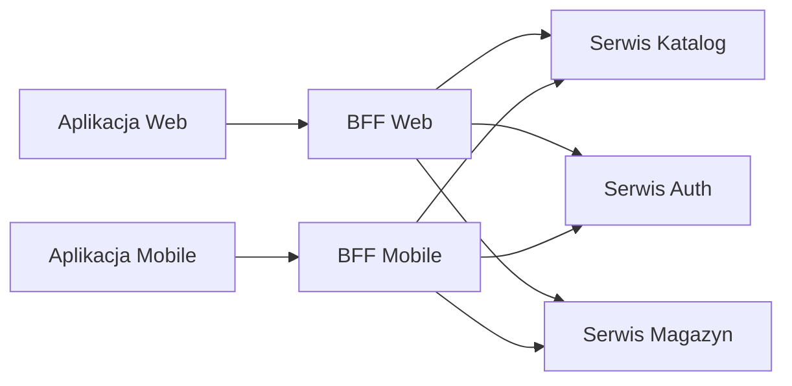

<!-- markdownlint-disable MD013 -->
# BFF (Backend for Frontend) – wzorzec, wymagania i ocena projektu

Dokument wyjaśnia wzorzec Backend for Frontend (BFF), sposób działania, implementację, wymagania
oraz powiązane tematy (API-First, Optimistic UI, Pessimistic UI i inne).
Zawiera ocenę, czy projekt MovieMind API spełnia założenia BFF.

---

## Spis treści

1. [Czym jest BFF (Backend for Frontend)](#1-czym-jest-bff-backend-for-frontend)
2. [Jak działa BFF](#2-jak-działa-bff)
3. [Jak zaimplementować BFF](#3-jak-zaimplementować-bff)
4. [Wymagania dla „prawdziwego” BFF](#4-wymagania-dla-prawdziwego-bff)
5. [Czy MovieMind API spełnia wymagania BFF?](#5-czy-moviemind-api-spełnia-wymagania-bff)
6. [Tematy pokrewne](#6-tematy-pokrewne)
   - [API-First](#api-first)
   - [Optimistic UI](#optimistic-ui)
   - [Pessimistic UI](#pessimistic-ui)
   - [Contract-First i API sterowane przez klienta](#contract-first-i-api-sterowane-przez-klienta)
   - [SPA vs renderowanie po stronie serwera a BFF](#spa-vs-renderowanie-po-stronie-serwera-a-bff)
7. [Zobacz też](#7-zobacz-też)

---

## 1. Czym jest BFF (Backend for Frontend)

**Definicja:** BFF to **jednocelewa warstwa po stronie serwera** dedykowana **jednemu doświadczeniu użytkownika** (np. jedna aplikacja webowa, jedna aplikacja mobilna lub jedna klasa klientów). Stoi między klientem a jednym lub wieloma backendami i jest często w posiadaniu tego samego zespołu co UI (wzorzec spopularyzowany przez Sama Newmana, stosowany m.in. w SoundCloud i REA).

**Porównanie z API ogólnego przeznaczenia:** Jedno API obsługujące wiele różnych interfejsów (web, mobile, partnerzy) staje się kompromisem: musi zaspokajać potrzeby wszystkich klientów, staje się wąskim gardłem i często jest utrzymywane przez osobny zespół „middleware”. Wzorzec BFF realizuje założenie **jedno doświadczenie, jeden backend**: każdy BFF jest dopasowany do jednej (klasy) frontendu.

**Typowa architektura:**

Jedno żądanie klienta do BFF może wywołać wiele wywołań do usług downstream; BFF agreguje wyniki i kształtuje odpowiedź pod tego klienta.

---

## 2. Jak działa BFF

- **Orkiestracja:** Jedno żądanie klienta może wywołać **wiele wywołań downstream** (równolegle lub sekwencyjnie). BFF agreguje wyniki i zwraca jedną odpowiedź dopasowaną do klienta (np. „lista życzeń ze stanem magazynowym i ceną” z serwisów: lista życzeń + katalog + magazyn).

- **Optymalizacja pod klienta:** Rozmiar payloadu, zestaw pól i liczba rund są dopasowane do danego UI (np. mobile: mniej wywołań, mniejsze payloady; desktop web: bogatsze dane). BFF ukrywa złożoność wywołań do wielu backendów.

- **Warstwa translacji:** BFF może adaptować protokoły (REST, gRPC, GraphQL), obsługiwać auth (tokeny, klucze API) i ukrywać granice wewnętrznych usług, tak aby klient widział jeden spójny API.

- **Obsługa błędów:** Gdy jeden serwis downstream nie działa, BFF może degradować się łagodnie (np. zwrócić częściowe dane, pominąć stan magazynowy) i nadal wystawiać spójny kontrakt dla klienta.

- **Reużycie:** Wspólna logika może być w bibliotekach współdzielonych lub w serwisie downstream „agregatorze”. Duplikacja między BFFami jest często akceptowalna, aby uniknąć silnego sprzężenia (Sam Newman: „relaksowane podejście do duplikacji między serwisami”).

---

## 3. Jak zaimplementować BFF

- **Własność:** BFF powinien być w posiadaniu tego samego zespołu co frontend (prawo Conwaya: granice zespołów wpływają na granice BFF). Dzięki temu API może ewoluować wraz z UI, a releasy pozostają zsynchronizowane.

- **Technologia:** Dowolny stos (Node.js, Laravel, Go itd.). Wybór zależy od umiejętności zespołu lub charakterystyki I/O (np. Node przy wielu równoległych wywołaniach asynchronicznych).

- **Odpowiedzialności:**
  - Wystawianie **niewielkiego, dopasowanego do doświadczenia API** (nie ogólnego CRUD odzwierciedlającego wszystkie backendy).
  - Wywołania serwisów downstream (REST, gRPC, GraphQL), **równolegle** tam, gdzie to możliwe.
  - Mapowanie/transformacja odpowiedzi, filtrowanie danych wrażliwych, auth i rate limiting.
  - Cache tam, gdzie ma to sens, z poprawną semantyką cache dla treści zagregowanych.

- **Kiedy dodać BFF:** Warto rozważyć BFF przy wielu typach klientów o różnych potrzebach, wielu mikrousługach (gdy klient musiałby wykonywać wiele wywołań) lub gdy zespół frontendu potrzebuje niezależnego cyklu wydań i własności API.

---

## 4. Wymagania dla „prawdziwego” BFF

| Wymaganie | Opis |
| --------- | ---- |
| **Jedno UI / jedno doświadczenie** | Jeden BFF na (klasę) frontendu, nie jedno API „dla wszystkich”. |
| **Orkiestracja** | Łączy wiele serwisów downstream w mniej wywołań po stronie klienta. |
| **Kontrakt zoptymalizowany pod klienta** | Kształt i rozmiar odpowiedzi dopasowane do tego klienta. |
| **Zgodność z zespołem** | Własność zespołu odpowiedzialnego za UI. |
| **Różnorodność downstream** | Zazwyczaj rozmowa z wieloma backendami (mikrousługi, API); nie tylko z jednym monolitem. |

Opcjonalnie, ale często: cache w BFF, auth na skraju sieci, translacja protokołów (np. REST wejście, GraphQL wyjście).

---

## 5. Czy MovieMind API spełnia wymagania BFF?

**Obecna architektura (na podstawie CLAUDE.md i api/routes/api.php):**

- **Jeden wdrożony backend:** MovieMind API to aplikacja Laravel będąca właścicielem domeny (filmy, osoby, seriale, generowanie, joby, health). Korzysta z jednej bazy (PostgreSQL), Redis i wywołuje **zewnętrzne** serwisy (OpenAI, TMDb, TVMaze). Nie ma wewnętrznej warstwy „wielu mikrousług”; API jest główną aplikacją.

- **Klienci:** API jest publiczne (REST, klucz API). W dokumentacji jest mowa o froncie (np. moviemind_frontend w MODULAR_MONOLITH_FEATURE_BASED_SCALING), ale API nie jest zaprojektowane jako „jeden BFF pod ten frontend” w ścisłym sensie.

- **Orkiestracja:** W monolicie występuje orkiestracja (np. wyszukiwanie łączy lokalną bazę z zewnętrznym TMDb/TVMaze w `MovieSearchService`), ale jest **wewnętrzna** względem aplikacji, a nie BFF wywołujący N wewnętrznych mikrousług.

**Ocena:**

- **Spełnia luźno:** API może pełnić rolę **jedynego** backendu dla jednego frontendu (np. jednej aplikacji web). W tym sensie jest „backendem dla frontendu”, ale nie realizuje wzorca BFF w typowym znaczeniu (agregator wielu backendów).

- **Nie spełnia ściśle:**
  - Nie ma osobnej „warstwy BFF” przed wieloma wewnętrznymi usługami.
  - System to **modularny monolit** z jednym publicznym API, a nie „jeden BFF na typ klienta” (np. osobny BFF na web i mobile).
  - Downstream to **zewnętrzne** API (TMDb, OpenAI itd.), a nie wiele wewnętrznych mikrousług agregowanych przez BFF.

- **Aby w przyszłości stać się „klasycznym” BFF:** Należałoby wprowadzić dedykowany serwis BFF, który (a) należy do zespołu frontendu, (b) wystawia API dopasowane do doświadczenia, (c) wywołuje obecne MovieMind API oraz ewentualnie inne backendy (np. auth, billing) i je agreguje. Obecne API byłoby wtedy jednym z serwisów **downstream**, a nie samym BFF.

**Podsumowanie:** MovieMind API jest głównym backendem domenowym i może obsługiwać jeden frontend; **nie** jest zaimplementowane jako BFF w ścisłym sensie (brak warstwy BFF per klient agregującej wiele wewnętrznych usług).

---

## 6. Tematy pokrewne

### API-First

**Co to jest:** API-First oznacza projektowanie i definiowanie kontraktu API (np. OpenAPI) przed lub równolegle z implementacją UI i backendu. API jest głównym kontraktem między frontendem a backendem (lub między BFF a usługami downstream).

**Związek z BFF:** BFF jest naturalnym miejscem stosowania API-First: API BFF jest jedynym, od którego zależy zespół frontendu; zdefiniowanie go najpierw (lub testy kontraktowe) utrzymuje frontend i BFF w zgodzie. MovieMind API wystawia REST i może być opisane przez OpenAPI/Swagger, co wspiera workflow API-First dla dowolnego klienta (w tym przyszłego BFF).

### Optimistic UI

**Co to jest:** UI aktualizuje się od razu tak, jakby operacja się powiodła (np. dodanie do koszyka, przycisk „lubię”), a w razie błędu z serwera wycofuje zmianę lub pokazuje błąd. Zmniejsza to odczuwane opóźnienie i poprawia responsywność.

**Związek z BFF:** BFF (lub dowolny backend) musi wspierać **idempotentność i jasne odpowiedzi błędów**, aby klient mógł bezpiecznie ponowić lub wycofać operację. Optimistic UI często idzie w parze z jednym endpointem „komendy”, który BFF orkiestruje, więc jedna runda może wywołać wiele wywołań downstream bez czekania klienta na każde.

### Pessimistic UI

**Co to jest:** UI czeka na odpowiedź serwera przed aktualizacją (np. spinner, wyłączenie przycisku do 200/201). Prostsze w implementacji, bez logiki rollbacku, ale użytkownik dłużej czeka.

**Związek z BFF:** Przy BFF klient wykonuje jedno wywołanie; opóźnienie BFF to suma wywołań downstream (chyba że równoległe). Pessimistic UI może być nadal akceptowalne, jeśli BFF utrzymuje niskie opóźnienia (wywołania równoległe, cache). Dla wolnych operacji (np. generowanie AI) API często zwraca „accepted” i ID joba, a klient odpytuje lub używa webhooków—forma odroczonej aktualizacji pasująca do obu podejść.

### Contract-First i API sterowane przez klienta

**Co to jest:** Contract-First: specyfikacja API (OpenAPI, schemat GraphQL) jest źródłem prawdy; kod i testy są generowane lub walidowane względem niej. Sterowane przez klienta (np. consumer-driven contract tests): klient (lub BFF) definiuje kontrakt, którego potrzebuje, a provider (serwis downstream) musi go spełniać.

**Związek z BFF:** BFF jest naturalnym „klientem” serwisów downstream. Użycie consumer-driven contracts (np. Pact) między BFF a każdym backendem gwarantuje, że backendy nie złamią oczekiwań BFF. Zespół frontendu może wtedy traktować BFF jako jedyny backend i stosować testy kontraktowe między frontendem a BFF.

### SPA vs renderowanie po stronie serwera a BFF

**Co to jest:** SPA (Single Page Apps) działają w przeglądarce i wywołują API (lub BFF) po dane. Aplikacje renderowane po stronie serwera (SSR) generują HTML na serwerze; serwer może wywoływać backendy lub BFF, aby zbudować stronę.

**Związek z BFF:** Przy renderowaniu po stronie serwera BFF jest naturalnym miejscem pobierania danych (jedno miejsce do wywołania wielu serwisów i przekazania danych do szablonów). Przy SPA BFF jest jedynym API wywoływanym z przeglądarki. MovieMind API jest używane jako backend dla klientów (np. SPA lub przyszłego BFF); samo nie decyduje o SPA vs SSR—to kwestia frontendu.

---

## 7. Zobacz też

- [Sam Newman – Backends For Frontends](https://samnewman.io/patterns/architectural/bff/)
- [Microsoft Azure – Backends for Frontends pattern](https://learn.microsoft.com/en-us/azure/architecture/patterns/backends-for-frontends)
- Projekt: [Analiza architektury](ARCHITECTURE_ANALYSIS.md) (Events + Jobs vs warstwa serwisowa)
- Projekt: [Modular Monolith z skalowaniem per feature](../knowledge/technical/MODULAR_MONOLITH_FEATURE_BASED_SCALING.en.md)

**Ostatnia aktualizacja:** 2026-02-21
